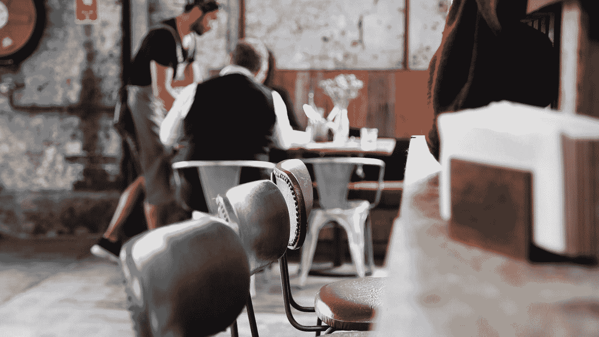

# 当顾客离开时，他们没说的话很重要

> 原文：<https://medium.com/swlh/when-customers-leave-what-they-dont-say-is-important-29a4781695b2>

## 如何留住客户并提供优质服务

Empty chairs. Photo by [Caroline Attwood](https://unsplash.com/@carolineattwood?utm_source=medium&utm_medium=referral) on [Unsplash](https://unsplash.com?utm_source=medium&utm_medium=referral)

一年多前，我在一家餐馆吃饭，服务员在整个用餐过程中对我很粗鲁。正因为如此，我很久没有回那家餐厅了。

当我给他们第二次机会时，我发现餐厅已经空无一人