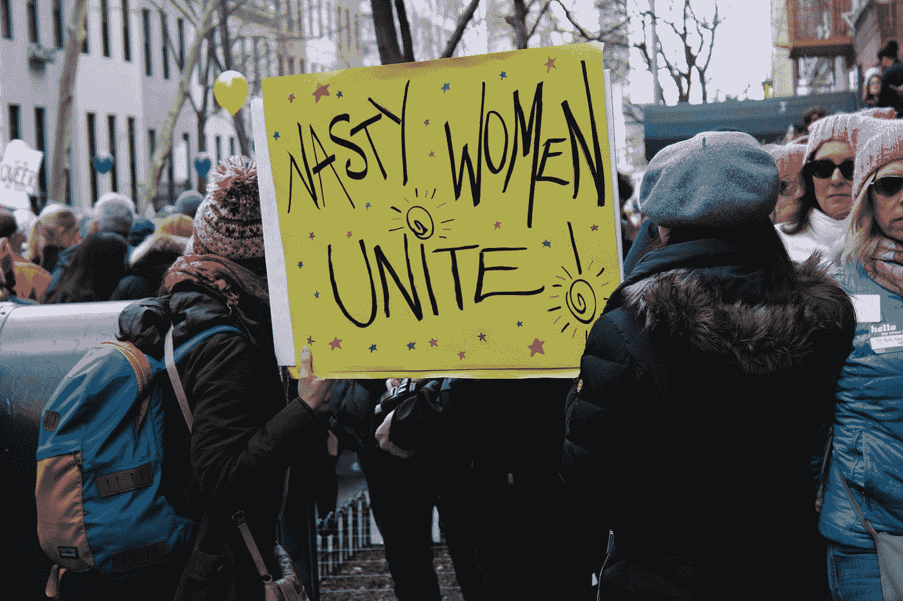

# 女权主义者什么时候变成了仇视男人的怪物？

> 原文：<https://medium.com/swlh/when-did-feminists-become-man-hating-monsters-1bf644324775>

## 他们没有——但是告诉千禧一代

Photo by [Monica Melton](https://unsplash.com/@monicomelty?utm_source=medium&utm_medium=referral) on [Unsplash](https://unsplash.com?utm_source=medium&utm_medium=referral)

当我问我的千禧一代女儿她是否认为自己是女权主义者时，当她说“不，我不会用那个标签”时，我惊呆了。

说，什么？一位独立、思想自由的年轻女性，事业蒸蒸日上，是自己公司的首席执行官，是一位世界旅行家，她选择了…