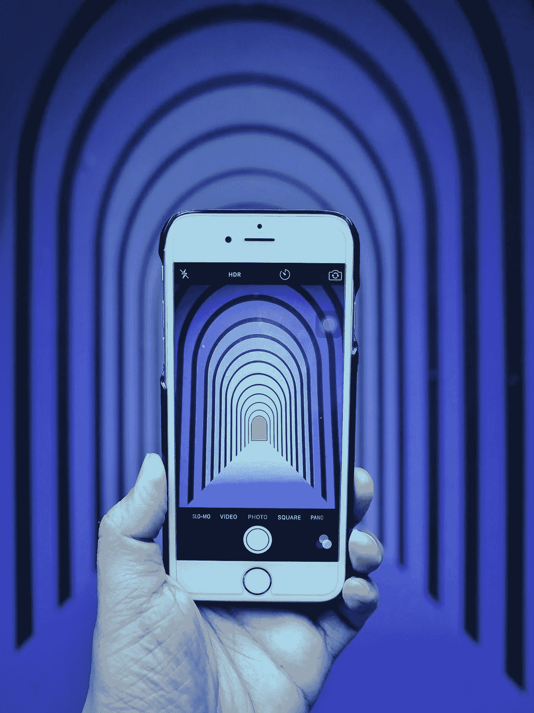

# 你的创业是幻觉吗？

> 原文：<https://medium.com/swlh/when-does-optimism-become-a-fabricated-story-86dbaa6f9eab>

Photo by [贝莉儿 NG](https://unsplash.com/photos/o_mdGdfyLHg?utm_source=unsplash&utm_medium=referral&utm_content=creditCopyText) on [Unsplash](https://unsplash.com/search/photos/optical-illusion?utm_source=unsplash&utm_medium=referral&utm_content=creditCopyText)

**什么时候乐观变成了编造的故事？**

我对最近的 Fyre 节日表演以及他们背后的人是如何被描绘的非常着迷。我是创始人，这是我的工作。我创造东西。我创建了几个企业，并利用它们为我和我的三个儿子创造了相当酷的生活。他们可以在没有任何学生贷款的情况下在欧洲和美国上学。幸运的男孩，他们知道这一点…