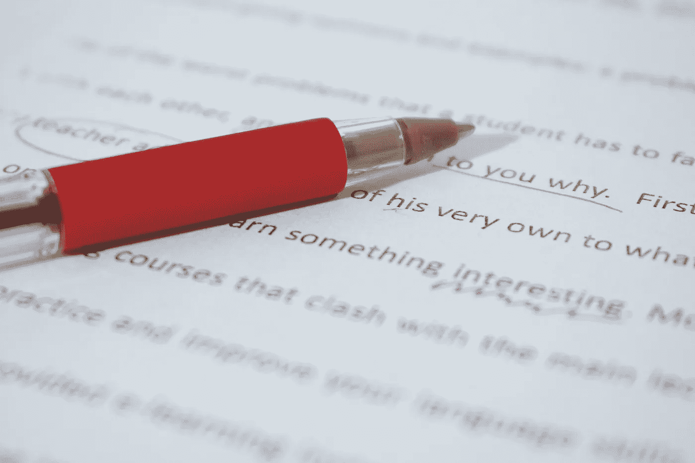

# 当编辑打破坏

> 原文：<https://medium.com/swlh/when-editors-break-bad-e8335b3fe879>

Photo from Canva

## 自由作家能做什么？

我最近向一家(非媒体)媒体投了一篇个人文章，当它被接受时，我激动不已。又一个署名！又一份薪水！

我花了整整一周的时间写作、修改，然后又写了一些，最后提交了我认为是 950 字的文章。