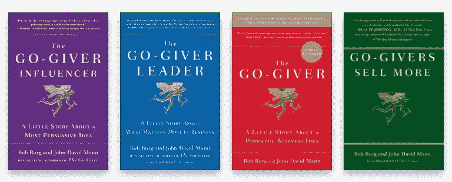

# 当伟大的客户服务意味着把客户送到别处

> 原文：<https://medium.com/swlh/when-great-customer-service-means-sending-the-customer-elsewhere-775c724ad0fd>

## 辩论

## 客户需要的最好的东西可能是你没有的

Photo by Dan Gold on Unsplash

我的哥哥冲进了房子。他从背上扯下工作包，大发雷霆。

“他到底为什么要和这些$%#&白痴签约？!"

他的管理层显然将他的部分项目外包给了该地区的一家精品咨询公司。当我问他发生了什么事时，他不能告诉我细节，但他这样描述了这次合作:

> 是这样的。你走进一家冰淇淋店，向店员要草莓冰淇淋。他答应了，但是因为他没有草莓冰淇淋，所以他给了你巧克力。你认为他可能听错了，所以你重复并纠正他说你要的是草莓，不是巧克力。店员然后告诉你，他没有草莓。他有巧克力。给你，拿着。

那一刻，我完全知道他在说什么。我曾经为一家不重视资源或业务模式的公司工作，以了解解决方案是否可行，是否会过度承诺，或者是否会做出不必要的妥协，从而无法完全解决客户的问题。然后，为了增长和收入，它会以某种方式说服其客户，它的解决方案是他们所需要的。

这么说吧，我离开那家公司是因为它没有体现我的价值观。

现在，我的兄弟——作为一家咨询公司的客户——表达了他对这些荒谬标准的失望。

# 粗略的解决方案

苹果。亚马逊。走开。倭黑猩猩。所有依靠突破性发明繁荣发展的创新公司。

他们茁壮成长是因为他们花费了数百小时，如果不是数千小时的话，进行市场研究、观察和角色扮演。他们是有远见的人，利用他们的想象力来发现大多数人没有发现的问题。

更简单地说，这些公司帮助人们识别真正的问题，从而提供真正的解决方案。

可悲的是，这也是最被误解的理由被崇拜者滥用。

问题是每个公司都想成为那样的公司。当客户确实知道真正的问题和真正的解决方案时，它希望成为解决每个人问题的*公司*甚至*。然后，当这些公司没有评估他们的人力、设备、基础设施或知识是否能够做到这一点时，他们会提出解决方案。*

*所以他们让员工拼命工作只是为了随机应变。*

*然而，我认为，即兴创作只能满足那些不知道自己想要什么或需要什么的顾客。即使这样，解决方案也是短期的，直到客户意识到他们需要更好的解决方案。*

*那些*确实知道*他们想要什么或需要什么的客户会去外面寻求解决方案，因为他们知道其他人可以比他们自己更好和/或更便宜地解决他们的问题。*

*不幸的是，许多公司声称自己是别人，但实际上他们不是。他们提供的解决方案可能解决部分问题，如果有的话。*

*如果你开始做建筑生意，但是你没有车，你不会希望一个汽车销售员坚持让你买一辆客车，因为他没有卡车了，你会吗？你会去不同的经销店。*

# *令人满意的解决方案*

*让我们再次重放那个场景。*

*你去车行找一辆卡车。可悲的是，推销员告诉你，你将无法在几个月内购买一辆卡车。现在，你愿意他给你一辆客车还是推荐给另一家有你想要的卡车的经销商？*

*我知道我的答案是什么。你呢？*

*即使这一次你不能从他那里买一辆车，当你认识的人需要买一辆客货两用车时，你难道不会考虑他吗，因为他考虑到了你的最佳利益。*

*当然，如果我是汽车销售员，我可能会失去一辆车的销售，但我可能会赢得一个以上的长期客户。*

*有时候你必须失去一些才能赢得更多。*

## *这一切背后的真正原因*

*不是不想为顾客服务。*

*这不是不想面对挑战或拓展自己的能力。*

*这不是对自己的技能、知识或资源不自信。*

> *这是为了给客户提供最好的解决方案，即使我不能提供。*

*当我在心里知道其他人——甚至是竞争对手——有资源创造比我更好、更快或更便宜的解决方案时，有时最好的做法是将客户引向正确的公司，即使这意味着失去业务，因为不仅该公司可能带着我能解决的问题回来，而且该公司可能会推荐其他公司与我合作。*

*这显示了真实、谦逊和对真正了解我是谁的信心。顾客尊重这一点。*

*这并不意味着我不能学习和获得知识和资源，在不久的将来创造出最好的解决方案。这只意味着我现在不能提供。*

*对于那些认为这一切都是无稽之谈的人来说，我不是唯一相信这一点的人。这是《勇往直前的 T4》一书的作者鲍勃·伯格和约翰·大卫·曼恩创立的“T2 五定律”的标志。*

**

*The Go-Giver Series by Bob Burg and John David Mann*

*如果这仍然不能支持我的论点，那就想想这对人际关系有什么影响。*

# *关系:结束*

*还记得你的迷恋或单方面的关系吗？他或她最后爱上了别人吗？*

*大多数关系专家、家人和朋友可能会告诉你接受它，为他/她高兴，让他/她走，继续前进。这样更健康，最终会让你获得新的、更好的爱情。*

*但是我们中有多少人——包括我自己——在情感上无法释怀，紧紧抓住他/她，试图阻止他/她离开？*

*这对你有用吗？对我来说没有。*

*在商业环境中，把那个人换成一个顾客。*

*当你知道你不能完全满足客户的需求时，如果你要求他们继续和你在一起，你认为客户会对你和你的公司评价高吗？*

*我认为不是。*