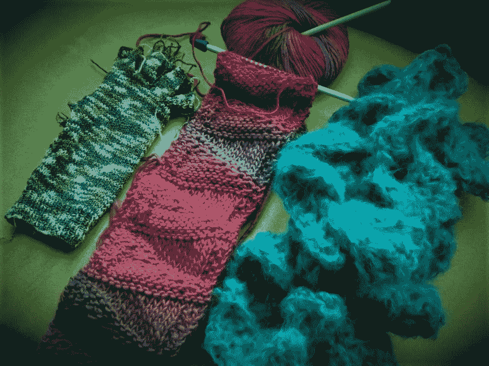

# 当爱好变成困扰:我如何发现我的生活失去平衡的迹象

> 原文：<https://medium.com/swlh/when-hobbies-become-obsessions-how-i-recognized-the-signs-that-my-life-was-out-of-balance-58dd68b0ef1d>

## 如果连你喜欢的事情都觉得是苦差事，那么是时候重新评估你的生活方式了。

Not pictured: several other WIP. It was getting out of control! Photo credit: Jennifer Brown

从前，我喜欢编织。有一段时间，有些人会说我有点痴迷于此:我会织帽子、袜子、手套、围巾和…