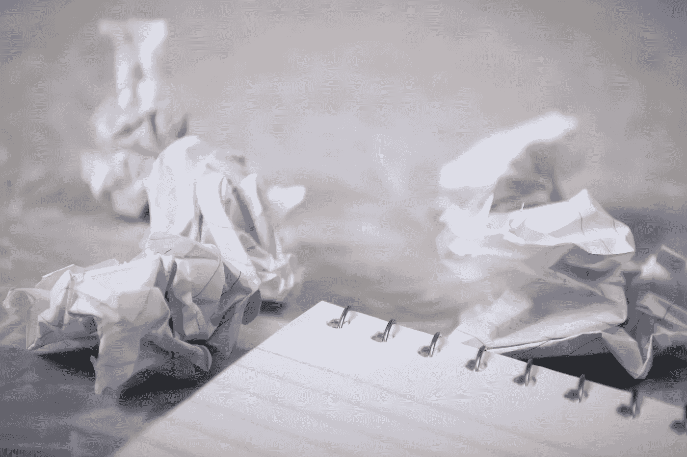

# 当我在介质上写不出东西的时候

> 原文：<https://medium.com/swlh/when-i-ran-out-of-things-to-write-on-medium-6d3e6a2a274c>

# 我试图找到这个问题的原因和解决方法。

Image by [Steve Johnson](https://pixabay.com/users/steve_a_johnson-8206634/?utm_source=link-attribution&utm_medium=referral&utm_campaign=image&utm_content=3259455) from [Pixabay](https://pixabay.com/?utm_source=link-attribution&utm_medium=referral&utm_campaign=image&utm_content=3259455)

就这样发生了。我在媒体上做得很好；我每周至少上传三篇文章，主要是关于我找工作和开始写作生涯的挣扎。我的写作生涯正顺利开始。然后，我碰壁了；我不知道下一步该写什么。我…