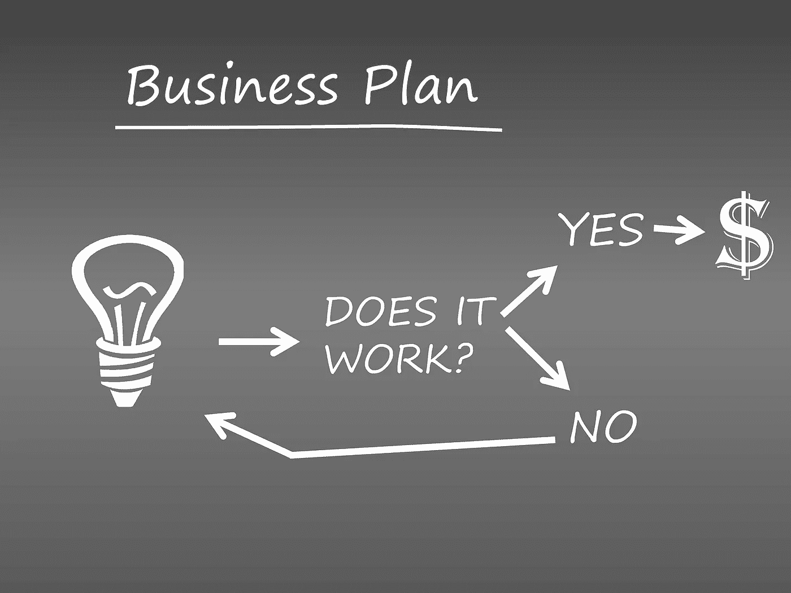

# 什么时候是开始创业的合适时机？

> 原文：<https://medium.com/swlh/when-is-the-right-time-to-start-your-venture-d0333449f7b>

这篇文章是写给所有想成为企业家的人的，他们认为现在是时候开始创业了，以下是我的人生故事。我开始得太早了，失败了很多次，但还是继续前进。

当我 19 岁的时候，我和我的同事开始了我自己的食品创业。我们过去常常在印度的街道上送餐，那时很难让我们的客户从我们的网站上在线订购。我们竭尽全力提供最优质的食品，但我们意识到我们走在了时间的前面&人们还需要 1-2 年才能理解印度的技术。

虽然我们提前了，但这是我们的失败，我们不得不关闭我们的第一个业务。当我们的第一家企业倒闭时，我非常沮丧，在我 20 岁的时候，我无法思考其他任何事情。定义你的目标市场潜在客户是我年轻时学到的最重要的一课。

我决定在 21 岁的时候创办我的 IT 公司，这次我的目标是全球市场。结果是一样的，因为我没有在 IT 公司工作的经验。我不得不面对客户获取、项目交付和为公司发展寻找合适人选的问题。

我花了 3 年时间学习各种创业技能，尽管我从一开始就有一项技能，即承担风险的能力:)

我和我的同事谁是印度最大的公司之一的首席技术官，开始了我们自己的风险投资，提供申请人跟踪系统，并解决创业公司和中型公司的招聘问题。这一次，我们为即将到来的挑战做好了充分的准备&使我们的产品尽可能简单，我们没有添加太多复杂的功能&不到一年， [**Gartner 将我们评为中小型企业招聘软件**](https://www.softwareadvice.com/hr/applicant-tracking-software-comparison/#top-products) 供应商的第一名。

讲这个故事的原因是，开始得早或晚都没关系。我一生中失败过很多次，但我有决心，有激情，从以前的错误中吸取教训，并致力于实现我的目标，这帮助我建立了世界上最简单的招聘工具。

我每天都在让自己变得更好，这对我打破以前的记录有很大的帮助。

如果你觉得为时已晚，只需在谷歌上搜索一下桑德斯上校，这个人从 65 岁开始，经历了 1009 次失败才获得成功。你的年龄可能是你拥有的经验和技能的年数。

尽早开始，你可能会失败很多次，但这真的会帮助你建立一个更好的公司。

希望你喜欢我的文章:)

## 这篇文章发表在 [The Startup](https://medium.com/swlh) 上，这是 Medium 最大的创业刊物，拥有+445，678 名读者。

## 订阅接收[我们的头条](https://growthsupply.com/the-startup-newsletter/)。

