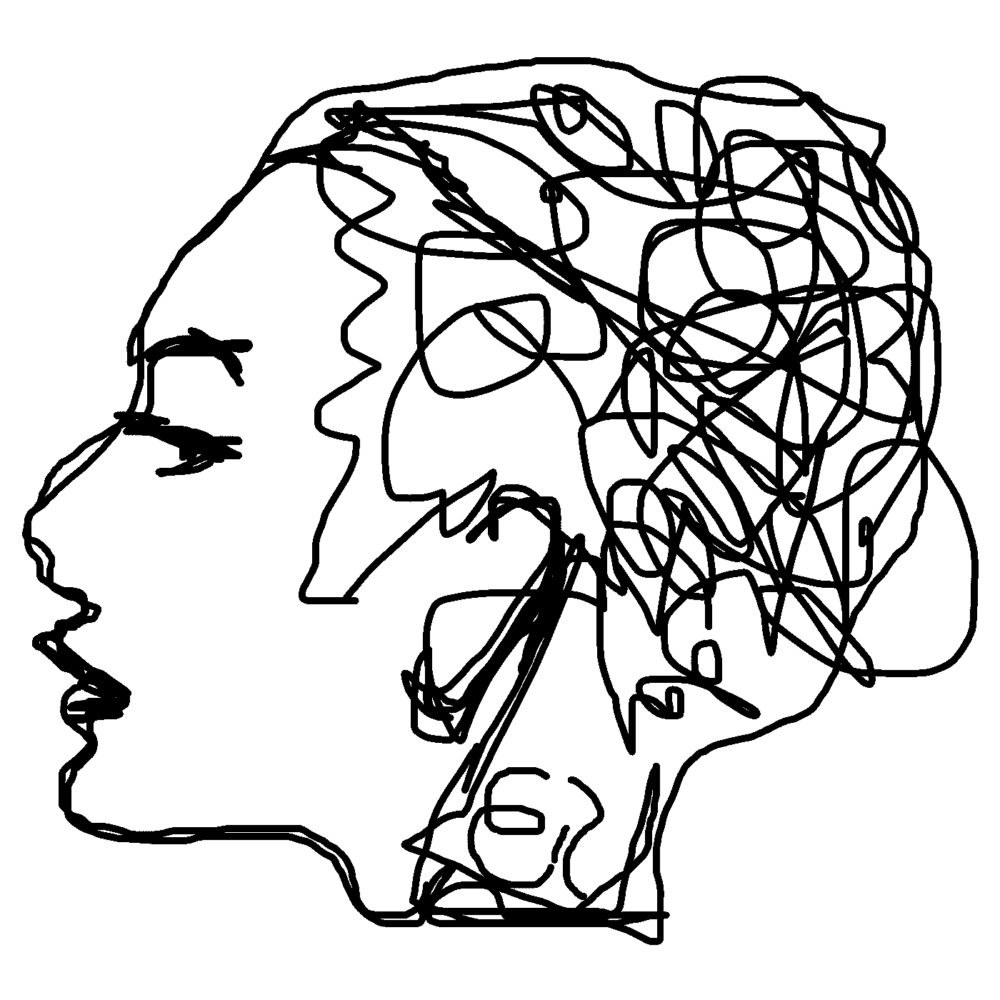

# 当感觉你的想法被劫持时

> 原文：<https://medium.com/swlh/when-it-feels-like-your-ideas-are-hijacked-596308d98afe>

## 这意味着什么，该怎么办。

Image by [ElisaRiva](https://pixabay.com/users/ElisaRiva-1348268/?utm_source=link-attribution&utm_medium=referral&utm_campaign=image&utm_content=2422442) from [Pixabay](https://pixabay.com/)

我年轻时的一小段时间是用来画我最新的时装设计草图的。尽管我不像 60 秒纪录片 中的一些孩子那样有创新精神，所以我的设计从未实现。

那是通过我。