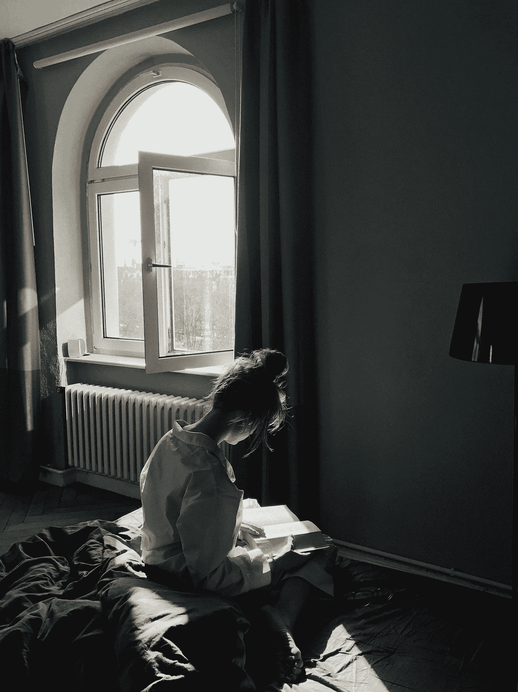

# 当詹姆斯·艾吉邀请我去他家时

> 原文：<https://medium.com/swlh/when-james-agee-invited-me-over-to-his-house-1445c81574bf>

## 阅读的惊人力量

Photo by [**Daria Shevtsova**](https://www.pexels.com/@daria?utm_content=attributionCopyText&utm_medium=referral&utm_source=pexels) from [**Pexels**](https://www.pexels.com/photo/woman-sitting-while-reading-a-book-1616779/?utm_content=attributionCopyText&utm_medium=referral&utm_source=pexels)

我小时候讨厌读书。在高中和大学(每所学校只上了一年——但那是另一个故事),我在任何需要阅读的地方跳踢踏舞。一旦不再需要它，我就完全避免它。

直到我有了第一个孩子。护理的神圣经验伴随着…