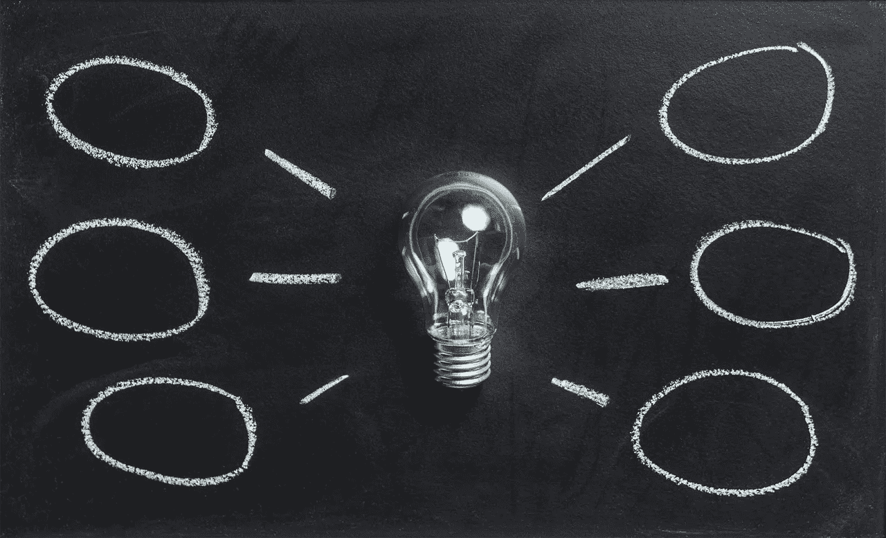

# 当生活给了你错误的教训

> 原文：<https://medium.com/swlh/when-life-teaches-you-the-wrong-lesson-6320953393ac>

生活是一系列的课程。你生命中的每一次经历，每一次经历，都会以某种方式塑造你。有些经历让我们变得更好、更有同情心或更成功；有些经历是有害的，让我们很难相信自己或对自己有信心。当生活中的一件事给了你一个教训，但却是错误的教训时，会发生什么？