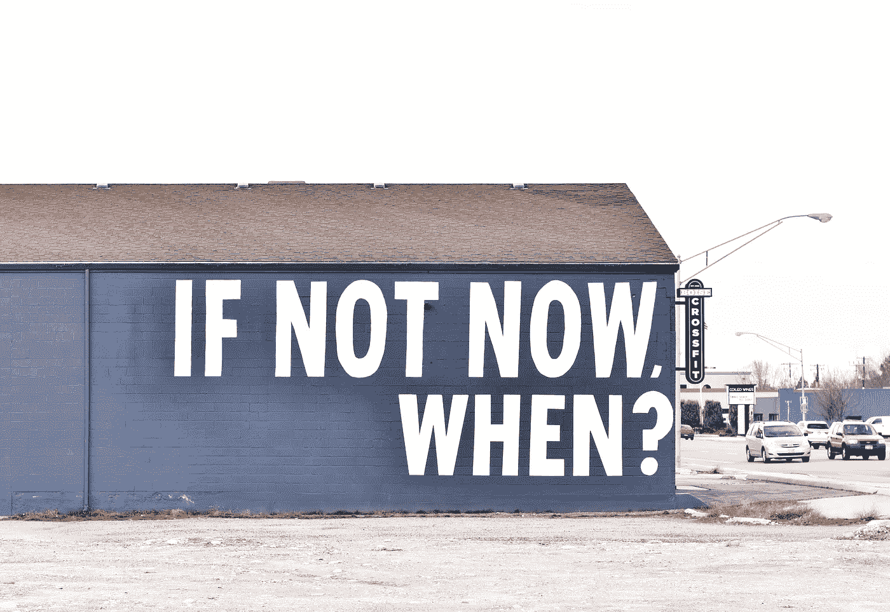

# 当放弃是最好的选择

> 原文：<https://medium.com/swlh/when-quitting-is-the-best-option-1f8fef9811b4>

Photo by [Allie Smith](https://unsplash.com/@creativegangsters?utm_source=unsplash&utm_medium=referral&utm_content=creditCopyText) on [Unsplash](https://unsplash.com/search/photos/motivation?utm_source=unsplash&utm_medium=referral&utm_content=creditCopyText)

小时候，我们被教导说“半途而废的人永远不会赢”，坚持承诺是有价值的。虽然这个建议大部分都是正确的，但有时候放弃实际上是好的。问题是，放弃的坏名声在我们童年时根深蒂固，以至于成年后我们觉得太没有安全感，不会考虑放弃某事或某人。有一种耻辱感和对判断的恐惧使辞职看起来很可怕，当…