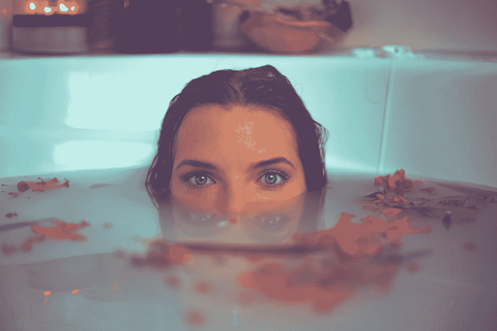

# 当自我护理超越了泡泡浴

> 原文：<https://medium.com/swlh/when-self-care-goes-beyond-bubble-baths-de3c77d55c92>

Photo by [Timothy Dykes](https://unsplash.com/@timothycdykes?utm_source=medium&utm_medium=referral) on [Unsplash](https://unsplash.com?utm_source=medium&utm_medium=referral)

与极简主义、正念和其他流行的千禧年术语一样，自我保健已经成为一个具有巨大收入潜力的营销术语。

有一天，我在向下滚动我的媒体源。瞬间，一个极简主义旅行包和自我护理包的在线广告弹出来了？说什么？

所以，我开始怀疑。人们如何看待自我保健？一个…