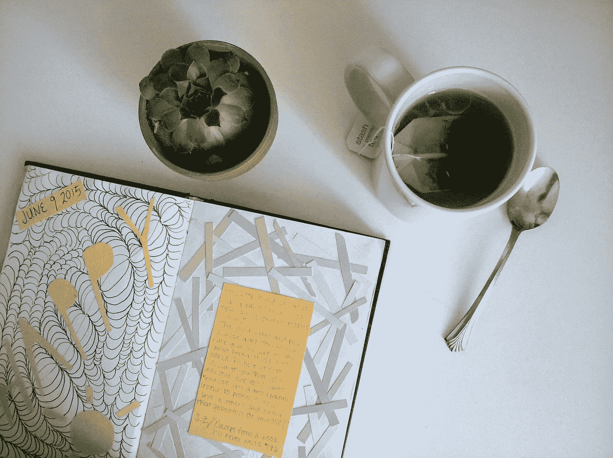

# 当#SelfCare 不再“值得使用 Instagram”

> 原文：<https://medium.com/swlh/when-selfcare-is-no-longer-instagram-worthy-8e04992be881>

这是漫长的一周。两篇论文，一次期中考试，三次田径训练，每次结束时都让我潸然泪下。我的焦虑空前高涨，我的抑郁让我每天早上都很难从床上爬起来。这一切都以周五下午在公共浴室的精神崩溃和恐慌发作而告终。一天结束时，我完成了。我无法坚持下去；我身心俱疲。我直接回家躺在床上。我已经两天没洗澡了，那天哭得太厉害，眼睛都睁不开了。我觉得疲惫不堪，毫无价值。

为了分散我的注意力，我浏览了 Instagram，希望能看到一张可爱狗狗的照片或其他能让我开心的东西。相反，我浏览了几张女孩练习#自我保健的照片。一个人在咖啡店的窗户边记着她的圣经，她的咖啡杯上有一颗泡沫状的心。另一个人正和她三个最亲密的朋友在镜子前自拍，她们每个人都戴着面具。在那一刻，我知道我需要自我护理，但我确信任何祛痘面膜或 7 美元的拿铁咖啡都无法改变我的感受。

过去几年，社交媒体上充斥着烛光泡泡浴、美甲和大量护肤品的照片，所有这些都被描述为“自我护理”。社交媒体影响者不断发布他们值得拍照的纵容会议的证据。以这种方式看待自我保健没有错，但是当与精神疾病作斗争时，自我保健更接近于人类的基本需求。当被这么多扭曲的自我保健概念包围时，很难相信你的自我保健已经足够了。但是自我照顾总是有价值的，即使它不是完全“不可替代的”。

大约一个月前，我坐在一张灰色的沙发上，从我的治疗师对面的学校健康咨询大楼楼上的窗户向外望去。半干的眼泪粘在我的脸颊上。

“不知道为什么。”

我告诉她我经常感到压力、不知所措和沮丧。我无法全身心地投入到我的人际关系中，因为我太累了，以至于我没有任何东西可以留给别人。我最近感觉不像我自己，我不知道为什么，也不知道我能做些什么来弥补。

“我认为你需要腾出时间来照顾自己，”她告诉我。

起初，这对我来说似乎不可实现。尽管我很喜欢经典面膜和美甲之夜的复兴，但我几乎无法去工作或完成我的任务。如果有的话，那会让我更加疲惫。但是当她解释了她的想法，我们开始制定计划时，我意识到我需要重新定义自我保健的概念。

根据她的定义，“自我护理”并不一定意味着去上瑜伽课，或者把你的全部收入投资在新的护肤品上，或者在泡泡浴时点蜡烛。自我保健仅仅意味着关注你身体的需求和执行简单的任务，即使你大脑中的一切都告诉你不是这样。

社交媒体已经改变了人们对照顾自己的概念，尤其是在精神疾病方面。说服自己你值得有时间休息和充电，这已经够难了；不断接触美丽、丰富的社交媒体上的精彩片段对有影响的人没有任何帮助。推广 Instagram 知名女性的完美生活导致了一种假设，即理想的自我护理是完美的，当受到焦虑、抑郁或其他心理健康问题的影响时，是无法实现的。

事实上，自我保健意味着更加关注你的睡眠习惯、饮食、人际关系和卫生。当一切似乎都在你的控制之外时，找到一组小任务有助于增加控制感，并能让你更好地把握当下。

对我来说，有时候自我护理就是把自己拖下床去洗澡，然后爬回床上。其他时候，我会强迫自己遵守和朋友一起喝咖啡的承诺，因为我知道这会让我微笑——即使我穿着睡觉时穿的衣服，没有心情继续交谈。还有一些日子，我呆在家里不去上课，因为我知道如果我去了，我会恐慌症发作。

自我保健是了解你一天需要做什么，以及什么会有助于或有损于你的心理健康。

有可能的是，对精神疾病的自我护理不会与一个拥有 4.6 万名粉丝的少女在 Instagram 上的反馈完全相同。它甚至不会像你朋友的 Snapchat 故事一样，因为他们花了一个晚上来放纵自己。

有时自我护理是混乱的。有时候很丑。而且几乎都不上镜。但有时，尽管你不断增长的待办事项清单上有未勾选的框，但感觉自己完成了某件事还是有帮助的。有些日子，它提醒你，你值得照顾自己，你值得幸福。

有时候，这就够了。