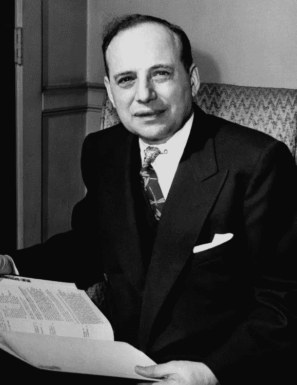

# 股票估值什么时候应该用格雷厄姆数？—价值股票指南

> 原文：<https://medium.com/swlh/when-should-you-use-graham-number-in-stock-valuation-value-stock-guide-17c3e58608ff>

Benjamin Graham, Photo: New York Guild for the Jewish Blind

[Ben Graham](https://valuestockguide.com/guide/benjamin-graham/) 给了我们许多[价值投资](https://valuestockguide.com/)的核心概念。他也给了我们一些捷径。格拉汉姆数是投资者估算股票内在价值的[捷径之一。](https://valuestockguide.com/all/estimating-intrinsic-value-for-stocks/)

# 格雷厄姆数是多少？