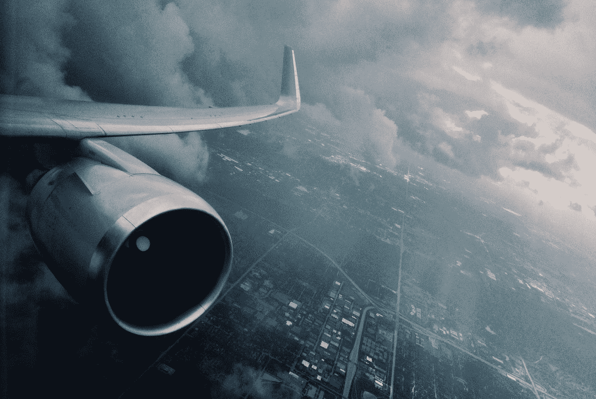

# 当软件杀死

> 原文：<https://medium.com/swlh/when-software-kills-ab6f48a15825>

Photo by [Julian Dufort](https://unsplash.com/@juliandufort?utm_source=medium&utm_medium=referral) on [Unsplash](https://unsplash.com?utm_source=medium&utm_medium=referral)

## 在最近的历史中，软件缺陷、错误和疏忽导致了数百起死亡事件。软件工程师有哪些外卖？

对两起涉及波音 737 飞机的致命坠机事件的初步调查显示，该公司的专有软件可能至少部分被…