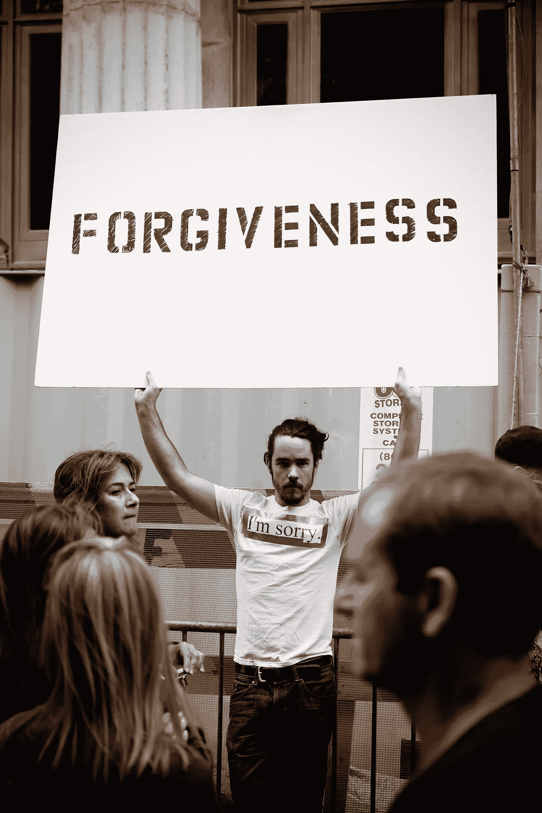

# 当有人不原谅你的时候

> 原文：<https://medium.com/swlh/when-someone-wont-forgive-you-2b92d7b52a7>

你能做什么？

Felix Koutchinski / Unsplash

也许你不是故意虐待某人，但是如果他们受到了伤害，你必须接受事实。也许这源于一个误解，或者也许你只关注自己的需求而忽视了其他人。不管发生了什么，是的，有时我们做了或说了一些伤害他人的话，以至于我们不会被原谅。有些人需要付出很多才能原谅其他人…