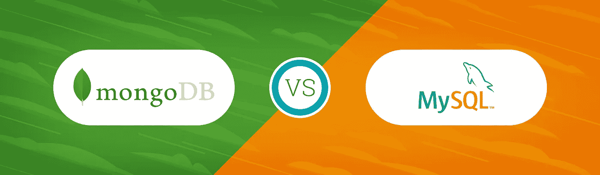
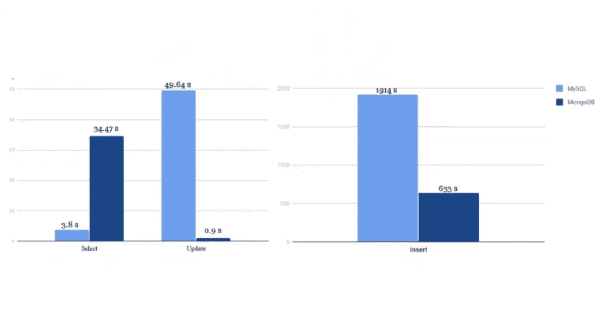

# 何时删除 SQL

> 原文：<https://medium.com/swlh/when-to-drop-sql-a7cc1b9ab2e5>

随着技术的发展和变化，为了更好地满足用户的需求，与之交互的方法(以及它的形式)也会随之改变，这是很自然的。我们可以在过去十年涌现的无数新编程语言中清楚地看到这一点，每一种语言都试图更接近地反映程序员的思维方式。

SQL 是在 70 年代由 IBM 的工程师发明的，从一开始就是数据库技术的主要部分。通过创建将表链接在一起的能力，SQL 使访问相关数据成为一个简单的过程，并为相同数据的完整性创造了奇迹；没有一条信息会被存储两次——任何事物都是作为与其他事物的关系的一部分而存在的。

然而现在，SQL 发明已经快 50 年了，需要操作的数据量急剧增加。由于大型服务器和较慢的速度，SQL 一直在努力满足工程师们不断增长的需求。这个问题的解决方法非常简单:NoSQL 数据库。

# 成为 NoSQL 数据库意味着什么？

人们在考虑 NoSQL 数据库时犯的一个常见错误是假设 NoSQL 意味着它不会有任何 SQL。事实上，NoSQL 数据库实际上是*非关系数据库*。这意味着它们没有构成关系数据库系统核心的外键交织。

在本文中，我们将使用 [MongoDB](https://www.mongodb.com/) 作为我们的 NoSQL 数据库模型，但是有许多服务，在各种各样的模型中，您都可以使用。为了启发你:

*   文档数据库: [MongoDB](https://www.mongodb.com/) ， [CouchDB](http://couchdb.apache.org/)
*   列数据库: [Apache Cassandra](http://cassandra.apache.org/)
*   键值存储: [Redis](https://redis.io/) ， [Couchbase Server](https://www.couchbase.com/)
*   缓存系统: [Redis](https://redis.io/) ， [Memcached](https://memcached.org/)
*   图形数据库: [Neo4J](https://neo4j.com/)

每一种都有不同的优点/缺点。如果您的数据非常简单，键值存储会非常强大；文档数据库是无模式的、JSON 邻近的存储，以一种非常直观和可靠的方法提供数据。

然而，本文是关于理解何时应该选择使用 NoSQL 而不是 RDMS(关系数据库管理系统)。考虑到这一点，让我们深入了解是什么让 NoSQL 现在如此受欢迎。

# NoSQL 与关系数据库的比较

Fig 1: Scalability of NoSQL Databases, courtesy of [DataJobs.com](https://datajobs.com/)

NoSQL 数据库最大的优势是可伸缩性，这也是它们脱颖而出的原因。如图 1 所示，NoSQL 数据库可以无限增长，而不会对性能产生重大影响。另一方面，关系数据库相对来说很快就出问题了。值得注意的是，在中小型数据库中，关系模型的速度有小幅提升。

Fig 2: Timing of operations between MySQL and MongoDB, courtesy of [dzone.com](https://dzone.com)

此外，关系数据库有一件事做得非常好:它们检索特定的数据。SQL 旨在利用关系非常高效地解析并返回特定记录。另一方面，当插入或更新记录时，它需要检查和更新所有这些关系。对于大数据应用程序来说，这并不理想。当你有几十亿条记录时，花很长时间来插入或更新记录是非常糟糕的。图 2 很好地说明了这一点。

此外，如果您的模式经常变化，您将需要设计一个适应每一个小变化的模式。有了 NoSQL 数据库，你就不用担心这个问题了。数据只是作为 blob 放入服务器。你把你放进去的东西拿出来，没有规定你能放进去什么，不能放进去什么。

最后一个主要的考虑是许多软件爱好者不愿意考虑的:物理约束。因为它们是必然交织在一起的，所以 RDMS 表需要能够彼此对话，并且能够自言自语。这导致了经典的*服务器塔*，或者单个大型机器。

因为 NoSQL 数据库只是存储大量的数据，它们实际上不需要能够相互交流；应用程序只需要能够访问它们。因此，它们可以分布在几台机器上，每台机器都不需要知道其他机器。因此，NoSQL 服务器实际上要便宜得多，而且在占用空间方面也更灵活。

# 句法

与所有技术一样，设置和生产的时间应该始终考虑在内。调动带来的好处值得为搬家而头疼吗？

SQL 是它自己的编程语言，有非常具体的语法。另一方面，MongoDB 使用一种与 javascript 和许多其他前端语言非常相似的语言。数据作为普通的旧 Javascript 对象(POJO)插入，并以类似的方式检索。

下面是两种语言的表创建语法的比较:

Fig 3: comparison of MySQL table creation to MongoDB

马上我们可以看到，MongoDB 的语法不仅看起来与 Javascript 极其相似，而且更加简洁。此外，对于任何经验丰富的程序员来说，MongoDB 都非常清晰易懂——没有太多的学习曲线。

值得注意的是，我们可以在第 4 行看到:SQL 数据库允许对数据进行限制。这就是所谓的*数据完整性*。SQL 可以对其数据做出保证，而 NoSQL 却不能。它可以执行服务器端验证，并防止重复数据。如果一个对象通过某种关系被许多人共享，那么这个对象就需要在 NoSQL 数据库中存储多次。虽然 NoSQL 确实通过降低特异性提高了速度和易用性，但为了达到同样的效率，需要做出一些妥协，这是值得注意的。

Fig 4: comparison of MySQL to MongoDB on insert

这个更简单。同样，MongoDB 示例看起来仍然像 javascript，SQL 看起来仍然有点陌生，但所有这些都非常相似。更新稍微复杂一些:

Fig 5: Updating Dave to be Sally

虽然这两个看起来不同，但它们实际上遵循相似的模式。首先，它们都定义了要使用的表(MongoDB 通过名称将表存储为`db`变量的一部分)。我们在表上调用 update，给出一个搜索参数(`my_table.update()`的参数 1)和一个要更新的字段/值。

至此，应该可以清楚地看到，MongoDB 使用基本的、容易理解的语法来完成大部分工作；如果您已经掌握了 JSON 的工作原理，在一个下午的时间里学会这些并不困难。

# 哪个更好？

事实上，两者都不是。这两种方法之所以存在，是因为它们是为满足特定需求而创建的。随着我们科学知识的增长，新技术自然会出现来解决来自新领域的问题。

RDMS 以一种直观快捷的方式简化了数据库项之间的关系。NoSQL 来解决 RDMS 服务器因堆积如山的数据而过载的问题。关键是理解你自己的数据的限制和局限性，以及如何最好地处理它。一般来说，问这些问题:

1.  我能从一套模式中获益吗？
2.  我的数据库需要存储多少条记录？
3.  我的数据需要安全合规吗？(很多 NoSQL 的数据库都不是)
4.  通过强制数据库中每个对象的唯一性，我可以节省多少空间？我有多关心我的数据库的完整性？
5.  在我的数据库中，什么样的操作是常见的？我会做大量的更新、选择或插入吗？

当您回答这些问题时，您开始看到您的数据库的形式。此时，只需选择最符合您需求的数据库。这不是关于对错:这是关于知道什么时候用螺丝刀，什么时候用锤子。这个世界充满了工具，一个好的工程师不应该在试图用扳手钉钉子的时候被撞死。

# 来源

旅游媒体教程:NoSQL 数据库介绍

 [## MongoDB 与 MySQL - DZone 数据库

### 从模式灵活性、关系、性能、速度、安全性等方面来看 MongoDB 与 MySQL。

dzone.com](https://dzone.com/articles/comparing-mongodb-amp-mysql)  [## NoSQL 介绍-极客论坛

### NoSQL 最初指的是非 SQL 或非关系数据库，是一种提供存储和管理机制的数据库

www.geeksforgeeks.org](https://www.geeksforgeeks.org/introduction-to-nosql/)  [## DataJobs.com:分析工作、Hadoop 工作、DBA 工作、数据科学工作

### 面向所有大数据的工作板-数据科学家、数据库管理员、Hadoop 技术、分析、数据分析师。我们相配…

datajobs.com](https://datajobs.com) 

横幅提供者:

 [## 全景智能云数据仓库

### Panoply 是一个人工智能驱动的自主云数据仓库。借助 Panoply，您可以将任何孤立的数据转化为洞察力…

panoply.io](https://panoply.io/)