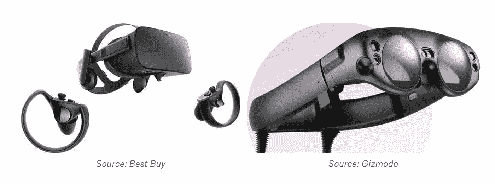
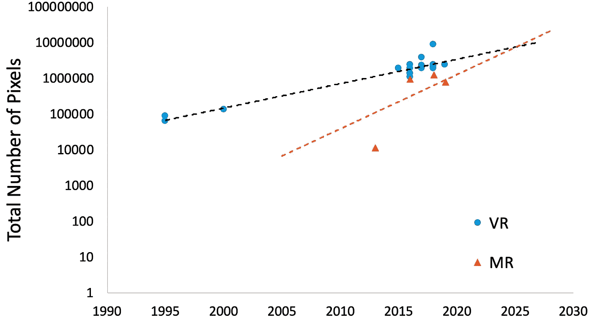
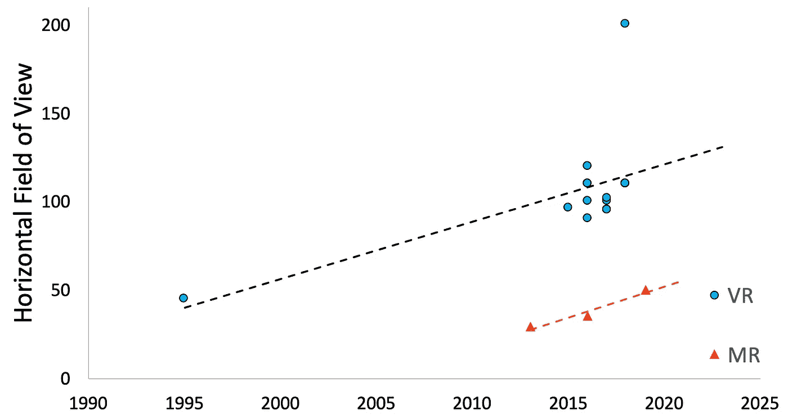

# 虚拟现实和混合现实什么时候看起来完全真实？

> 原文：<https://medium.com/swlh/when-will-virtual-reality-and-mixed-reality-look-completly-real-185fb14a4df0>

## 利用技术预测来比较预测未来

有一天，我们将能够戴上一副眼镜，从纽约地铁站被传送到巴厘岛的沙滩椅上。有一天，这种像雷朋眼镜一样轻的眼镜，将会让我们在起居室里保持干燥的同时畅游大堡礁的深处。有一天，虚拟现实和混合现实将成为我们工作、交流、娱乐和探索的中心，渲染的物体/世界将与真实的东西 100%无法区分。利用趋势预测技术，我希望预测这一天何时到来。

Photo by [Martin Sanchez](https://unsplash.com/photos/JQ0YVavMKLo?utm_source=dropbox_paper&utm_medium=referral)

# 我说的是什么技术？

1.  虚拟现实(VR)——完全沉浸式耳机，如 [Oculus Rift](https://www.oculus.com/) ，它阻止用户看到设备内显示的任何其他内容。
2.  混合现实(MR)——一种新兴技术，允许用户看到与周围环境“混合”在一起的虚拟物体。这意味着即使用户在房间内四处移动，对象也是固定的。此外，[混合现实](https://www.recode.net/%202015/7/27/11615046/whats-the-difference-between-virtual-augmented-and-mixed-reality)物体必须能够从多个焦点看到[。这是指眼睛可以聚焦在近处的物体上，而背景对感知变得模糊，反之亦然。](https://techcrunch.com/%202017/04/07/an-afternoon-with-avegants-prototype-light-field-display-headset)

Oculus (left) and Magic Leap (right)

# “与现实无法区分”到底是什么意思？

这意味着你的眼睛在耳机里看到的东西和你在阅读设备上看到的一样清晰。这意味着这些耳机将充满我们的整个周边视觉。以下是专家们说的量化数据:

1.  每只眼睛的分辨率为 10，200 X 7，800 像素的屏幕
2.  [220+](https://vr-lens-lab.com/field-of-view-for-virtual-reality-headsets/) 度的视野

# 我是巫师吗？

我确实有一根《哈利·波特世界》里的魔杖，但是很遗憾，没有。

# 但是我该如何预测呢？🔮

借助一点现代魔法(数据)，我们可以进行趋势预测，并推断当前轨迹及其对未来的影响。

# 什么时候屏幕分辨率好到可以忽悠我？

随着屏幕分辨率的增加，图像质量提高，而“[屏门效应](https://www.vrheads.com/what-screen-door-effect-and-why-does-it-happen)减少。我绘制了我能从虚拟现实和混合现实显示器中找到的所有历史分辨率数据。新兴技术通常处于更快的增长曲线上，超过现有流程的能力，并导致更快的改进。从图中可以看出，这里的情况似乎也是如此。

> 该预测预测 2040 年 VR 和 2032 年 MR 将实现显示器的像素密度，看起来与现实生活没有区别。

我的直觉是，考虑到手机在过去十年中的进步，这似乎相当合理。误差来源可能是 2012 年之前存在的有限数量的数据点。

# 耳机什么时候能延伸到眼睛能看到的地方？

视野是对虚拟对象在外围视觉中可以呈现多远的度量。与虚拟现实显示器相比，这是混合现实显示器目前最大的缺点。Nvidia 在 2013 年展示的光场显示器的视野为 [29 度](http://lightfield-forum.com/light-field-camera-prototypes/nvidia-near-eye-light-field-display/)，不到同年发布的 [Rift DK1](https://www.google.com/url?sa=t&rct=j&q=&esrc=s&source=web&cd=11&ved=2ahUKEwjslOen1v_fAhUtUt8KHdwvD-UQFjAKegQIBxAB&url=https%3A%2F%2Fcanvas.upenn.edu%2Fcourses%2F1288987%2Ffiles%2F55081330%2Fdownload%3Fwrap%3D1&usg=AOvVaw2afigjW0uVB4lI5-zvQ2o4) 的三分之一。

> 该预测预测 2050 年虚拟现实和 2068 年磁共振将达到 220 度的 FOV，以涵盖人类的全部周边视觉。

这大概是一种过于悲观的展望。Primax 8k 已经拥有 200 度的 FOV。随着越来越多的制造商开始关注这一指标，我相信这一数字将成为常态，而不是离群值。在这个指标中，混合现实可能仍然会落后于虚拟现实，但不会像这个预测可能显示的那样剧烈。

# 那么这意味着什么呢…？

虽然这些预测应该持保留态度，但完全真实的 VR/MR 显示器可能在不到 20 年的时间里出现的事实表明，这项技术正在迅速发展。类似于手机和电脑的引入，用例及特性会随着时间的推移而增加。这些设备不需要创造出与现实难以区分的体验来改变用户的生活。

# 我做了什么假设？

1.  分辨率图测量显示器上的总像素。

*   我想标准化数据，因为不同的制造商使用不同的显示器尺寸。例如，146 X 78 的显示器在图上的值为 11，388。

2.驱动 [Magic Leap](https://www.magicleap.com/magic-leap-one?utm_source=google_ad&utm_medium=search&utm_campaign=launch_ps_ml&utm_content=mlptxt1&gclid=EAIaIQobChMIhreosYfu3wIVlcDICh287wn9EAAYASAAEgJyVvD_BwE) 的光场显示器，将继续呈现指数级的质量提升，就像 LCD/有机发光二极管显示器的分辨率一样。

*   光场显示器[将光线](https://spectrum.ieee.org/tech-talk/consumer-electronics/gaming/4d-light-field-displays-are-exactly-what-virtual-reality-needs)投射到眼睛中，允许眼睛转移焦点并看到特定深度平面上的物体。

3.来自这个[维基百科](https://en.wikipedia.org/wiki/Comparison_of_virtual_reality_headsets)页面的数据，以及关于 [ODG](https://www.osterhoutgroup.com/products-compare) 、 [Nvidia](http://lightfield-forum.com/light-field-camera-prototypes/nvidia-near-eye-light-field-display) 、 [Primax](https://pimaxvr.com/pages/8k) 、 [Hololens](https://www.sizescreens.com/microsoft-hololens-specifications/) 的网站报道都是准确的。

## 这篇文章发表在 [The Startup](https://medium.com/swlh) 上，这是 Medium 最大的创业刊物，拥有+417，678 名读者。

## 在这里订阅接收[我们的头条新闻](http://growthsupply.com/the-startup-newsletter/)。

