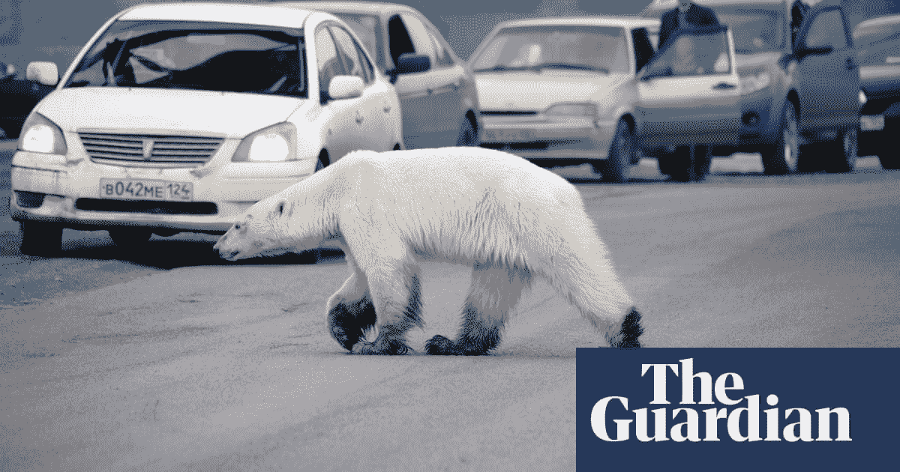

# 我们什么时候才能意识到我们是那只饥饿而困惑的北极熊？在应对气候灾难时，唤起人为隔离的感觉和“其他人会拯救我们”的态度。

> 原文：<https://medium.com/swlh/when-will-we-realize-that-we-are-that-hungry-and-confused-polar-bear-34f72e54f968>

> 结束我们应对全球变暖的消极态度，在我们采取行动的道德责任中变得真实和叛逆。

