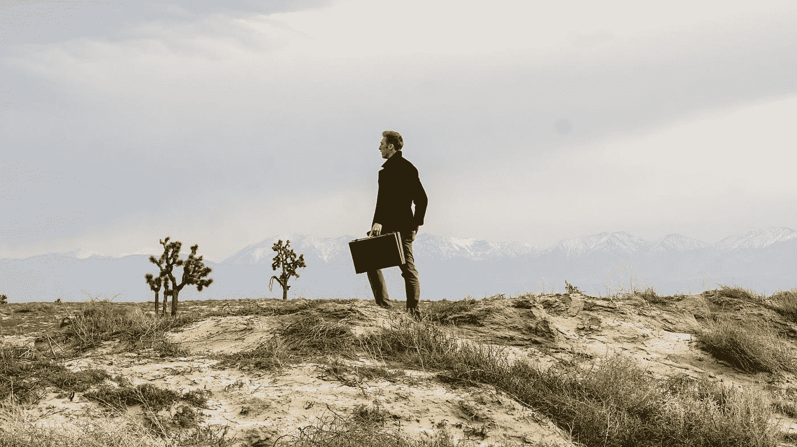

# 当你定义了成功，你的习惯就会改变

> 原文：<https://medium.com/swlh/when-you-define-success-your-habits-will-change-54df8cbcb2e2>

## 拒绝让文化来定义成功对你和你的创造过程意味着什么。

Photo by [Fred Kearney](https://unsplash.com/@fredasem?utm_source=medium&utm_medium=referral) on [Unsplash](https://unsplash.com?utm_source=medium&utm_medium=referral)

每个人都对成功有一定的看法。有些观点是由家庭形成的，家庭往往对我们影响最大，尤其是在生命的早期。其他的则出现在我们对“美好生活”美好得难以置信的描述中