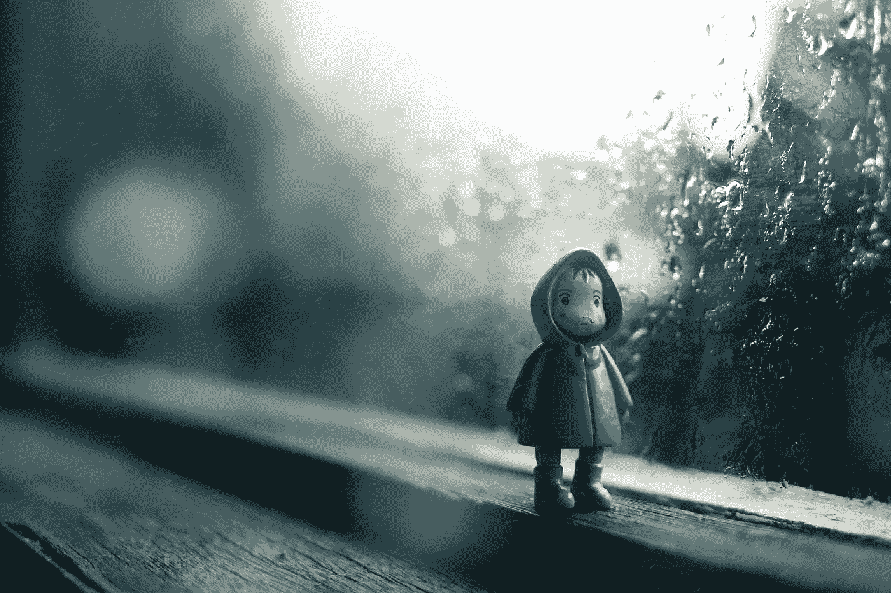

# 当你的头脑风暴失去光芒时，如何变得有创造力

> 原文：<https://medium.com/swlh/when-your-brainstorms-lose-their-lightning-73d5dde08f73>

Photo by [Rhendi Rukmana](https://unsplash.com/@rendisssta?utm_source=unsplash&utm_medium=referral&utm_content=creditCopyText) on [Unsplash](https://unsplash.com/search/photos/gloomy-weather?utm_source=unsplash&utm_medium=referral&utm_content=creditCopyText)

街区。所有艺术家都知道。所有的艺术家都害怕它。对于所有有创造力的人来说，都有不具备创造力的时候，这是一个普遍接受的事实。它像海浪一样强大，像天坑一样具有毁灭性。创意街区，无论是什么类型的创作，都像季节一样自然。