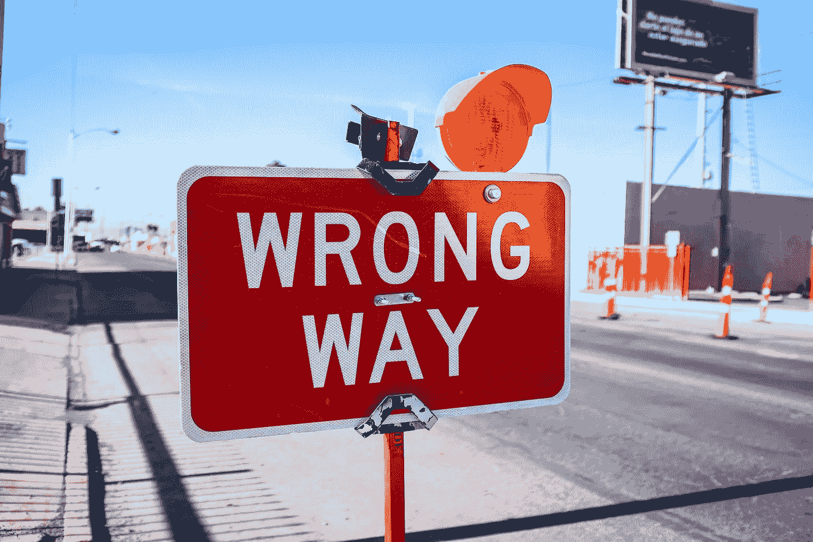

# 当你的生活正如你所担心的那样

> 原文：<https://medium.com/swlh/when-your-life-has-become-exactly-what-you-feared-it-might-fd06a6469089>

Photo by [NeONBRAND](https://unsplash.com/photos/-Cmz06-0btw?utm_source=unsplash&utm_medium=referral&utm_content=creditCopyText) on [Unsplash](https://unsplash.com/search/photos/disappointment?utm_source=unsplash&utm_medium=referral&utm_content=creditCopyText)

# 然后呢？

根据 JK 罗琳 2008 年在哈佛发表的毕业典礼演讲，对她来说，“失败意味着剥离不重要的东西”和“停止假装…她不是她自己”的能力，并通过这种经历找到完成“对她来说唯一重要的工作”的能量我喜欢这个故事。我…