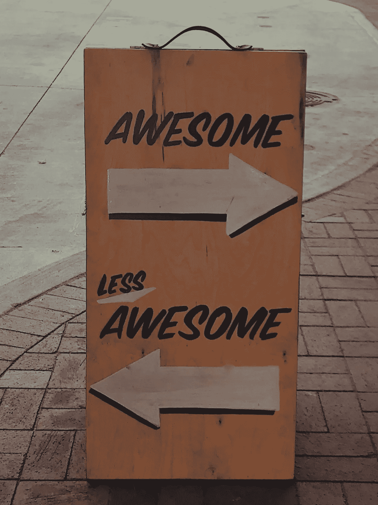

# 你上次得到好的反馈是什么时候？

> 原文：<https://medium.com/swlh/whens-the-last-time-you-got-good-feedback-9b39a7a549a5>

你上次得到好的反馈是什么时候？

不是拍拍后背，给你脸上挂个微笑的反馈。我指的是有效的反馈，帮助你积极改变自己的反馈。

*Original photo by Jon Tyson on Unsplash*

无论是来自负责评估你表现的经理、同行评估系统，还是 360 度全方位的练习，给予和接受反馈都是大多数…