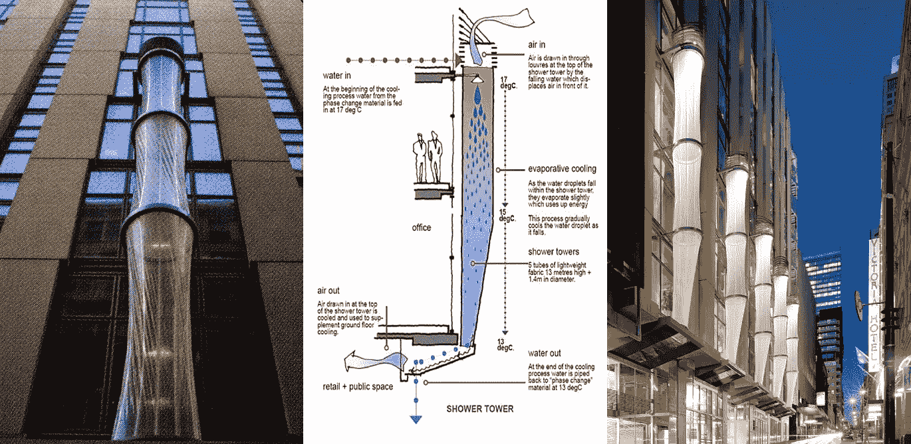
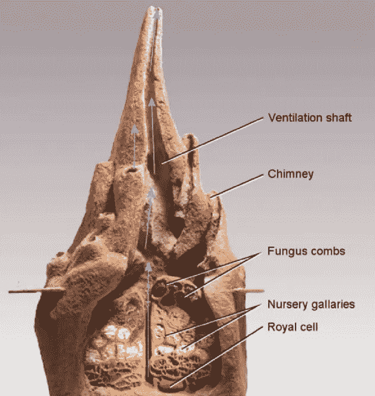
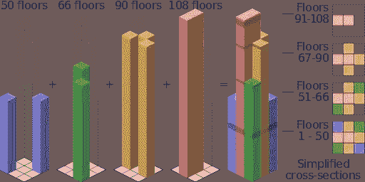

# 创意从何而来？

> 原文：<https://medium.com/swlh/where-do-ideas-come-from-601f62c72261>

## 考虑创造力和创新的主要来源

René Magritte painting “La Clairvoyance”, 1936

当创造或创新时，总会有一个参考，通常来自研究和经验。从抽象到现实，从形式到功能，或者从可用性到可访问性，考虑我们正在做的工作的参考点是很重要的。这推动了理性、目的、品味和创新。

当我们着手工作时，很容易被细节和技术问题所困扰。毕竟，这是完成工作的工作。但是，从客户或观众体验开始，并回溯到使之成为可能的细节和技术，才是前进的正确方式。这种观点会导致更多的问题和失败，但是真正的创新是从解决这些问题和了解这些失败中产生发现。从某种意义上说，呆在未知的地方是意想不到的事情发生的地方，虽然呆在那里的不确定性可能会让人感觉不舒服，但这也是最令人兴奋的地方。

Council House 2, an administrative building for the City of Melbourne, Australia. Termitary ventilation shaft.

当我们解决问题时，明智的做法是将自然和科学视为灵感的来源。[米克·皮尔斯](http://www.mickpearce.com/biomimicry.html)，一位在津巴布韦工作的建筑师，通过研究非洲和澳洲的白蚁丘，设计了哈拉雷最大的没有空调的建筑，结果是一座[建筑](http://www.mickpearce.com/CH2.html)，比周围所有的建筑节省了 90%的能源。这向我们表明，当我们努力理解自然和科学的复杂性时，我们可以得出导致创新的原则。

虽然研究通常与科学有关，但它可以很容易地应用于任何创造性的过程。在工业化的黎明，解决与生产技术、效率和性能相关的新问题，所以人们研究这些课题来回答社会和商业中的问题。今天，人们正在研究人类行为和大脑，以不同的方式分析问题，并质疑现有的解决方案。

Visualization of the bundled tube structure employed at Willis Tower. Source: Cmglee/Wikimedia Commons

最终，创新的灵感可以来自任何地方，任何时间——而不仅仅是来自大自然。法兹鲁尔·汗(Fazlur Khan)在设计芝加哥 108 层的威利斯大厦(Willis Tower)时，受到了一包用橡皮筋绑着的香烟的启发。这就是说……向意想不到的灵感来源敞开大门可能是最重要的。

我们是否能解决问题的问题并不总是关于能力和才能，而是我们是否准备好探索意想不到的解决方案。

*René Magritte. La Clairvoyance (Clairvoyance), 1936; oil on canvas, 21 1/4 x 25 9/16 in.*

# 这篇文章有价值吗？使用链接分享。反馈还是想法？分享一下评论。

## 关于作者

*约书亚·霍林是一位* [*作家*](https://joshuahoering.com/writing)*[*设计师*](https://joshuahoering.com/designprocess)*[*教育家*](https://joshuahoering.com/teachingphilosophy)*[*艺术家*](https://joshuahoering.com/fineart) *，以及* [*演讲者*](https://joshuahoering.com/speaking) *总部位于伊利诺伊州芝加哥。他目前正在萨凡纳艺术学院&设计学院攻读平面设计&视觉体验的艺术硕士学位。****

## **更多关于约书亚的信息:**

**[*推特*](https://twitter.com/joshuahoering) *，*[*insta gram*](https://www.instagram.com/joshuahoering/)*，*[*Pinterest*](https://www.pinterest.com/joshuahoering/)*，* [*脸书*](http://www.facebook.com/joshuahoering) *，*[LinkedIn](https://www.linkedin.com/in/joshuahoering/)**