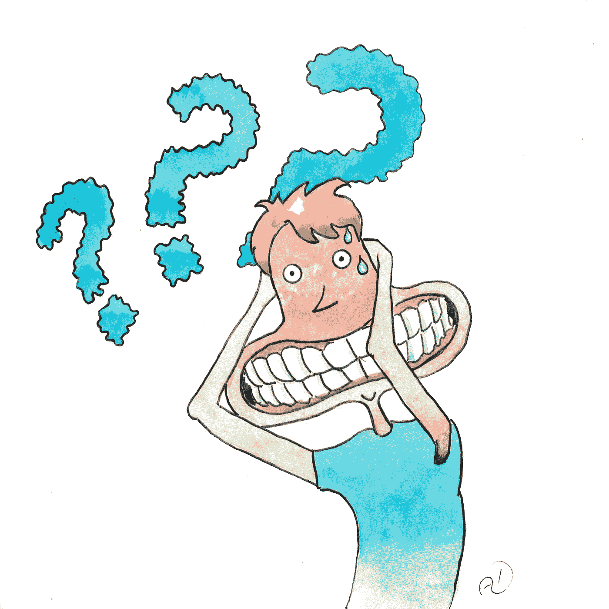

# 你的焦虑到底来自哪里？

> 原文：<https://medium.com/swlh/where-does-your-anxiety-really-come-from-939a90f00a54>

## 以及帮助我理清头绪的 10 个习惯

Illustration by yours truly

随着人类向不同于其他类人猿的方向进化，他们进入了不可预见的思想领域。几千年来，我们的祖先能够利用他们的思想来获得进化优势。然而，在 21 世纪，思想领域似乎引发了比以往更多的问题。大多数情况下…