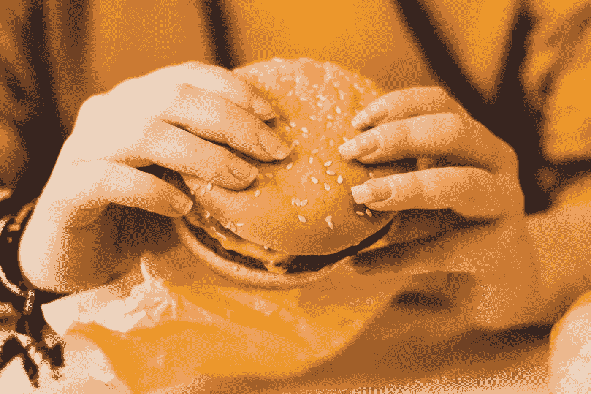

# 牛肉在哪里？

> 原文：<https://medium.com/swlh/wheres-the-beef-7f2d5b501551>

## 麦当劳看到了鲜肉的成功

## 看来人们真的是为了——囫囵吞下——食物的质量才去麦当劳的

Credit: Photo by [Christian Wiediger](https://unsplash.com/@christianw?utm_source=unsplash&utm_medium=referral&utm_content=creditCopyText) on [Unsplash](https://unsplash.com/search/photos/mcdonalds?utm_source=unsplash&utm_medium=referral&utm_content=creditCopyText)

为什么乡亲们都在[麦当劳](https://www.mcdonalds.com/us/en-us.html)吃饭？也许你的孩子想要那个[快乐套餐](http://www.happymeal.com/)玩具？也许你需要一大杯咖啡和一个香肠饼干，然后再去上班？也许哪里也不去…