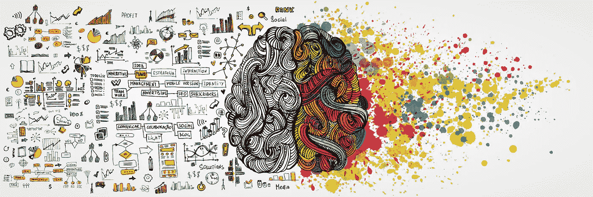

# 创造力和商业哪个更重要？

> 原文：<https://medium.com/swlh/which-matters-more-creativity-or-business-b256df4d5f38>

## 这场争论真是无事生非

很多人会在创意和财务、运营和营销之间划一条线，把自己放在这条线的一边，认为他们这一边是成功的驱动力。

引用莎士比亚的话，我称这些辩论为“无事生非”。没有界限，界限不应该被画也不存在，因为成功的驱动力是两者。他们需要在你的组织中愉快地共存，这样组织才能兴旺发达。

争论的解决办法是结束公司，或者学习同时掌握两者。你必须学会生活在模糊的生活中，生活在“这样和那样”中，既要有创造力，又要成为优秀的商人。两者兼得。

在麦迪逊墙公司集团，包括创意展位和 BGO，我们称自己为创意机构。但我们也在做生意。如果我们不做生意，我们就没有任何东西可以创造。如果我们没有创造力，我们就不会有生意。

理论上，这说起来很容易。即使是我们，在麦迪逊墙的这个行业，也不断地在这两者之间挣扎。但我们的意图、重点和战略是在这两方面都充分发挥作用。

在我们存在的十多年里，我们学到了下面这些我将传授给你的建议。

## 你的员工需要知道他们的立场。

当人们知道他们在你的组织中所处的位置时，你将会得到更好的创造性产出。角色和责任的清晰是关键。如果你的员工知道他们需要做什么，知道他们的期望是什么，知道他们的经营战略是什么，知道他们可以利用什么资源。当对期望没有困惑时，就有更多的心理能力去做得更好。

## 让你的员工有清晰的目标和方向。

每天帮助他们看到最终目标，知道整个团队，而不仅仅是个人，在朝着什么方向努力。当他们知道团队的发展方向，以及他们所扮演的角色如何融入整体时，他们就能尽自己最大的能力去扮演那个角色。

## 衡量你的结果。

当结果是可量化的和有形的时，创造性的产出会更好。我坚信，头号动力或满足感是进步感。

归根结底，创意机构仍然是一门生意。因此，如果您想保持企业的连续性，就不能忽视一些基本事实。找到一个平衡点，这样你就可以在鼓励创新的同时保持组织的财政责任。

 [## 公司文化新发现的重要性

### 年轻一代越来越关心他们工作的公司的文化。这是好事吗？

medium.com](/swlh/the-newfound-importance-of-company-culture-66bf9e1872f9) 

我不害怕承认，即使在麦迪逊墙十年之后，我们仍然没有到达那里。我经常意识到我让我的团队感到沮丧。我挫败自己。当我们试图到达那里的时候，我们挫败了自己。但我们的目的是不断努力，一个项目一个项目地找到最佳点。我们都希望在创意产出方面出类拔萃，给客户带来惊喜。我们希望让我们的银行家对产生这种创造性产出的财务结果感到惊讶和震惊。

不要让你的组织在创造力和商业之间划出界限。创意就是生意，反之亦然。为了成功和成长，不要忽视这一点。

*阿隆·韦伯是一位连续创业者，是* [*韦伯投资有限责任公司*](http://webberinvestments.com/) *的首席执行官，也是* [*麦迪森沃尔机构*](http://www.madison-wall.co/#home) *的管理合伙人。*

如果你喜欢这篇文章，请点击拍手按钮，并在下面留下任何问题或评论。

查看我的 Quora 和 LinkedIn 页面了解更多信息。

## 这篇文章发表在 [The Startup](https://medium.com/swlh) 上，这是 Medium 最大的创业刊物，拥有+415，678 名读者。

## 在这里订阅接收[我们的头条新闻](http://growthsupply.com/the-startup-newsletter/)。

