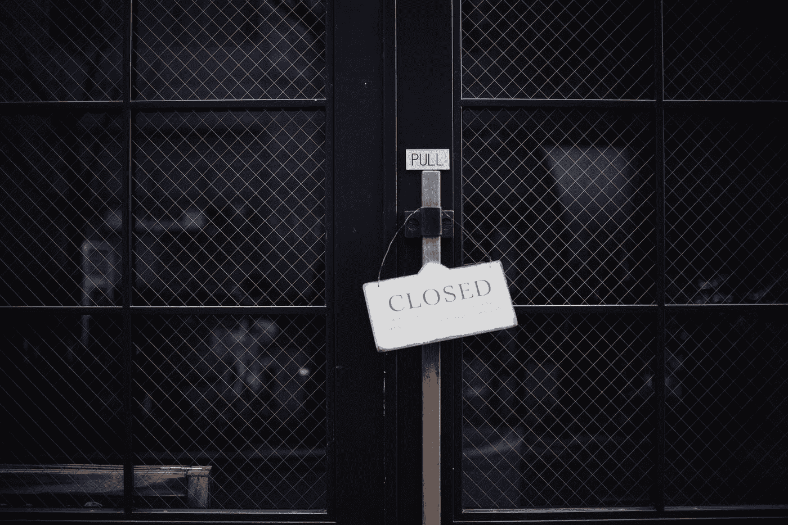

# 你是这些企业中的哪一个？

> 原文：<https://medium.com/swlh/which-of-these-businesses-are-you-469ea10db023>

## 创作者尽可能长时间留在游戏中的秘密

Photo by [Masaaki Komori](https://unsplash.com/@gaspanik?utm_source=medium&utm_medium=referral) on [Unsplash](https://unsplash.com?utm_source=medium&utm_medium=referral)

K **odak** 以为是做化学生意的。他们想出售图像处理、胶片和纸张。这种方法奏效了一段时间。直到它没有。柯达不知道自己真正从事的是什么业务——记忆保存业务。数码摄影几乎让这个摄影巨头破产。