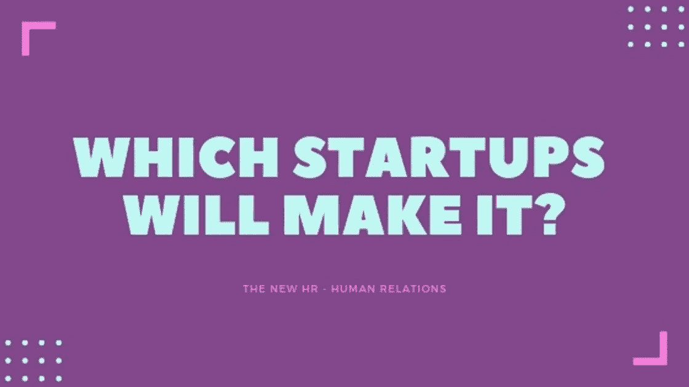

# 哪些创业公司会成功？

> 原文：<https://medium.com/swlh/which-startups-will-make-it-f8352fe469d8>

如今，初创公司的发展速度非常快，在许多方面，这已经将公司的核心价值从关注技术转移到关注人才。每个人都在谈论人是公司最大的资产，这直接将人力资源主管推到了聚光灯下。

聪明的领导者在谈论保持强大的企业文化的重要性，这种文化基于一套特定的价值观。但是还没有人谈论这个房间里的大象——人类自我的爆发是如何让公司失去一切的。我在创业公司呆了很长时间，知道当创始人开始互相憎恨时，当内部政治吞噬一切时——公司关门让所有人回家只是时间问题。

实际上只有一个企业家在谈论人类自我的癌症，那就是 VaynerX 董事长兼 VaynerMedia 首席执行官[加里·维纳查克](https://www.linkedin.com/feed/update/urn:li:activity:6517062423080370176)。加里维最近一直在谈论[为什么你可能不得不解雇你最有才华的员工](https://www.linkedin.com/feed/update/urn:li:ugcPost:6512312333014953984):

> “当我雇人时，我更看重‘人际技能’,而不是才能。对我来说，这种认为一些员工如此特别或如此有才华，以至于他们被允许成为其他人眼中的混蛋的想法是最荒谬的。不管你是有史以来最伟大的销售人员还是最有创造力的天才，我更感兴趣的是你如何首先对待他人。”

我不得不承认，我一直认为他是个多嘴多舌的人，直到我注意到他已经聘请了一位首席心灵官[克劳德·西尔弗](https://www.linkedin.com/in/casilver/)，并且他认为她是公司第二重要的人物——这是一个相当大的突破。我知道他是一个骗子和社交媒体偶像，但他如此重视人们如何对待彼此的事实非常有趣。积极的人际关系是我们可持续未来的关键，但没有多少人明白这一点。

但是加里维还不明白的是:假设你解雇了那个混蛋，办公室里的每个人都松了一口气。你觉得队里下一个混蛋还要多久才会出现？一周？一个月？如今，人类的自我意识越来越强，以至于人们发现很难控制自己的情绪。人们不知道如何处理这些多余的能量。

> "没有一个问题可以从创造它的同一意识层次上解决."
> 
> [人名]阿尔伯特·爱因斯坦(犹太裔理论物理学家)

*GaryVee 正在谈论* [*情商*](https://youtu.be/t0aBRVgbsJs) 的重要性，但是在一个人类情感一直在膨胀的世界里，我们如何利用这一点呢？我们如何将人性的负面转化为正面，以一种有益于整体的方式？如果你试图在与人类自我相同的水平上改善你的企业文化，你怎么能改善它呢？如今，为了获得显著的结果，我们需要一种稍稍超越人类自我的方法。

*以下是给创业公司和像 GaryVee 这样有远见的领导者的一些建议，他们真正关心的是建立可持续的人类组织，这些组织将永远存在:*

# #1 了解人类的自我

我们喜欢认为自己是好人，但有许多科学研究证明，在相同的条件下，人们的行为总是一样的。人类从优于他人的感觉中获得快乐——这就是我们被设计的方式。我们从出生开始就被训练在我们做的每一件事上都要有竞争力，但是现在我们的世界是如此的相互联系，这已经不再是可持续的了。在我们已经处于的新的全球生存阶段，我们需要学会和谐地共同前进。因此，我们的自我将不得不学习一些新的技巧，或者它将不得不被“欺骗”以不同的方式表现。不管怎样，我们最终会明白，我们必须善待周围的人。

# #2 投资于增强人际关系

正如我在开头提到的，人类的自我在我们这个时代达到了顶峰。我们生活在一个奖励脱颖而出和做最好的自己的社会。但是我们开始明白这并没有把我们带到一个好的地方。我们现在正进入一个新的阶段，在这个阶段，我们必须不断努力对抗我们这个时代正在爆发的自我的负面力量。我们必须在家庭、教育机构和企业界培养人际关系。各种规模的初创公司在完成产品和满足期限方面都存在问题，原因仅仅是公司里的人无法相处。

# #3 您的环境就是一切

我喜欢加里维说他正在围绕文化建立独裁统治的方式。如今，你真的必须保持警惕，以保持你的环境积极向上，并朝着你想要的方向前进。一个人从外部带来一些“病毒”(不同的价值观)并“感染”公司的每个人，这真的足够了。所以你想不断地宣传你的特定价值观的重要性。你的团队成员同意以这种方式被“洗脑”,因为他们明白，最终，你所做的对所有人都是有益的。他们有时可能不同意某个决定。这可以公开讨论，以促进公司的既定目标。但是他们都需要全力以赴，知道如果他们不喜欢这个独裁政权，他们需要找到另一个归属。

# #4 关注团队绩效

个人绩效评估可能会暴露出每个人最糟糕的一面。它们可能会增加竞争力，制造大量不必要的紧张。我相信，在不久的将来，我们将过渡到只奖励团队成就，和/或为团队协作提供最大的奖励。

# #5 连接全球团队

成功的创业公司在世界各地都有办公室，我们很容易与今天所有的干扰脱节。有很多现有的机会来连接和同步全球团队，这将为克服现有的障碍(语言、文化、心态等)创造奇迹。)这需要特殊技术和特殊方法的结合，我将在本系列的第二部分中讨论这一点。

*请注意:*

我选择这个标题是因为我注意到我 2014 年的帖子， [*哪些企业家会成功？这是我有史以来最成功的帖子。*](https://www.linkedin.com/pulse/20140608081233-95950-which-entrepreneurs-will-make-it/)

我只想澄清一下，我不是人力资源专业人士——我是人际关系专业人士——这是一个即将疯狂起飞的新领域。

也想澄清一下我对[加里·维纳查克](https://twitter.com/garyvee)和整个[威内美迪亚](https://twitter.com/VaynerMedia) & [加里维团队](https://twitter.com/TeamGaryVee)的看法:我以前觉得他是个以自我为中心的混蛋，喜欢听自己说话。但是当我真正开始听他的时候，我意识到他正在鼓舞和帮助很多人——真的鼓舞了他们，这真是太酷了。这是一堂共情课吗？然后他推出了他的移情葡萄酒品牌。好吧，算了吧。让每个人都思考换位思考是多么天才的举动。如今还有什么比这更重要呢？

希望你喜欢看这篇文章，请在下面留言告诉我你的想法。

*   *本系列的第二篇文章将介绍一种增强人际关系的特殊方法***。**
*   *本系列的第三篇文章将展示你的 [*营销沟通*](http://bit.ly/HumanBrandingTips) *s 如何在这个世界上每个初创公司都必须经历的重要转变中扮演重要角色。**

**

## *这篇文章发表在 [The Startup](https://medium.com/swlh) 上，这是 Medium 最大的创业刊物，拥有+438，678 读者。*

## *在这里订阅接收[我们的头条新闻](https://growthsupply.com/the-startup-newsletter/)。*

**