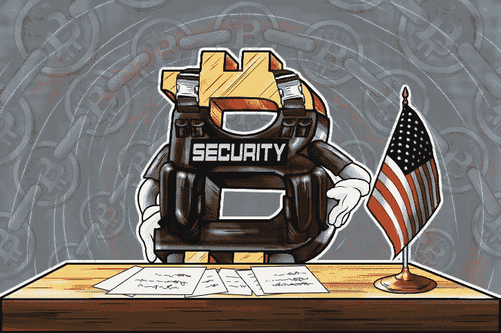

# 区块链分析公司 Whitestream 发现哈马斯向比特币基地的比特币账户筹款。

> 原文：<https://medium.com/swlh/whitestream-a-blockchain-analytics-firm-identified-hamas-fundraising-to-coinbase-bitcoin-account-59d10961d4bd>

以色列区块链分析公司 Whitestream 在哈马斯官方数字媒体渠道的捐款请求中发现了比特币基地加密货币交易平台上的比特币钱包地址。1 月 31 日，哈马斯军事组织发言人阿布·奥贝达在电报频道上呼吁人们捐款支持“抵抗运动”。

尽管比特币基地没有就所有问题发表评论，但 Whitestream 表示，即使在新闻传遍社交媒体并被媒体确认后，该账户上仍有交易。

*“根据共享信息，我们可以判断哈马斯区块链的交易是由比特币基地公司钱包上的地址签署的，”*该公司创始人兼首席执行官 Itsik Levy。

将所有三个账户加在一起，Whitestream 发现巴勒斯坦组织哈马斯的筹款活动似乎已经积累了不到 4000 美元的比特币。

*“[哈马斯]正努力从以色列政府和卡塔尔获得资金，”* Levy 说。*“我们听说其他伊斯兰极端组织在过去几年里也在做同样的事情……现在哈马斯也在尝试同样的事情。”*

“这仍然是一场活跃的运动，”他继续说道。*“刚刚开始。”*

此外，据报道，Whitestream 发现这个哈马斯运营的比特币基地账户可能会将比特币发送到一个 CoinPayments 账户和一个币安账户，最终是一个在开曼群岛合法注册的钱包提供商。CoinPayments 和币安没有立即回复对这些交易的置评请求。

## **加密货币与战争。**

Whitestream 的联合创始人 Itsik Levy 向 Globes 提到，他的公司调查的所有比特币交易中，“只有 2%”与*“恐怖主义或犯罪活动”有关*

哈马斯的发言人在 2 月 2 日最后一次请求比特币捐款后，没有在 Telegram group 上发帖。

他们可能受到了哈马斯的竞争对手伊斯兰国加沙组织的启发，据报道，截至 2018 年 3 月，该组织筹集了价值 8000 美元的比特币捐款。此外，他们的支持者对区块链技术有些困惑

1 月 30 日，巴勒斯坦记者 Hussam Al-Dajany 在接受哈马斯拥有的阿克萨电视台采访时说:*"任何安全机构都无法查明使用这种货币捐款的人的身份。*

***引文:***

*Cuen，l .，& Cuen，l .(2019 . 02 . 07)。区块链分析将哈马斯筹款与比特币基地比特币账户联系起来。https://www.coindesk.com/hamas-coinbase-bitcoin*

*如果您想了解更多，请访问 BIDITEX 页面并提出您的问题，关注我们的* [*推特*](https://twitter.com/biditex_com) *，* [*脸书*](https://www.facebook.com/biditex/) *，* [*中型*](/@biditex) *，* [*电报*](https://t.me/biditex%20%28edited%29) *等。投标变更同***。**

**

## *这篇文章发表在 [The Startup](https://medium.com/swlh) 上，这是 Medium 最大的创业刊物，有+421，678 人关注。*

## *在这里订阅接收[我们的头条新闻](https://growthsupply.com/the-startup-newsletter/)。*

**