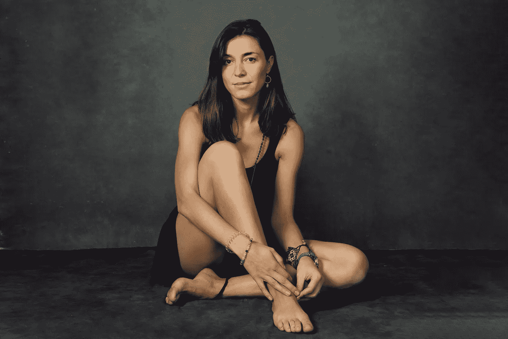

# 我是谁？自我探究之路

> 原文：<https://medium.com/swlh/who-am-i-8ac1be99f2c1>

## *一场严重的抑郁症如何成为我一生中最大的幸事*

【2018 年初，一位亲爱的朋友给我发了一段 youtube 视频，视频中是一位天使般的女子，声音如天鹅绒般柔软。它问了一个最简单却最有力的问题。“我是谁？”

Photo credit: [Olya Photography](https://www.olya.photography/)

我很幸运(也很不幸)拥有一颗学术和分析的头脑。观看之前…