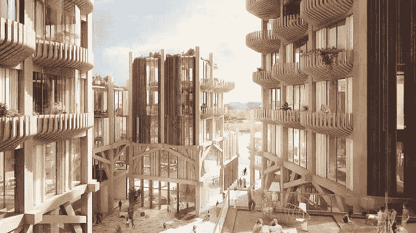

# 智慧城市是为了谁？

> 原文：<https://medium.com/swlh/who-are-smart-cities-for-797e83f5f526>

Sidewalk Labs, Toronto Quayside, Artist’s Impression.

## 也许我们不应该让科技公司创造我们的社区。

智能城市最近成为头条新闻，尤其是在 Alphabet 旗下的 Sidewalk Labs 公布了其多伦多滨水区的计划之后。

创造一个充满科技的乌托邦的诱惑并不新鲜，但这些计划比以往任何时候都更接近具体的现实。嗯，木材…