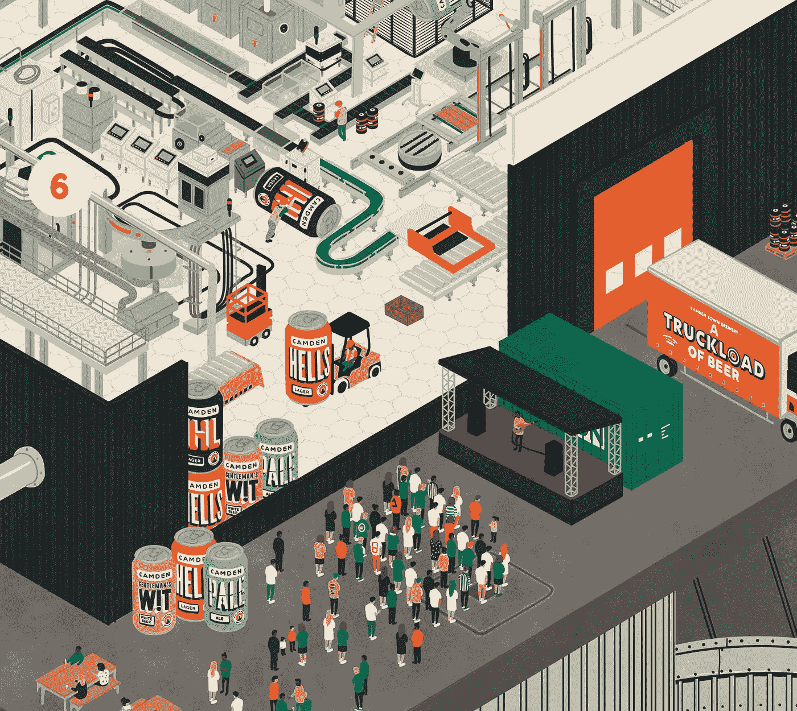

# 谁逃脱了技术失业

> 原文：<https://medium.com/swlh/who-escapes-technological-unemployment-d085548af9f8>

## 反叛者、福音传道者、创意者

*joeprytherch.com/illustrati0n*

我们生活在一个独特的技术领域。我们可以生活在水下，我们认真考虑殖民月球和火星，我们越来越接近治愈最致命的疾病。

# 消费主义历史

毫无疑问，这是最好的时机。然而，这个技术圈在 200 年前才开始形成。迈向现代科技繁荣的最初推动力始于蒸汽机的出现。18 世纪中叶，詹姆斯·瓦特改进了托马斯·纽科门的蒸汽机。

蒸汽机中使用的原理一直是主要的动力来源，直到 20 世纪初，电动机和内燃机的发展将重点转向更有效和更强大的能源。这是一个转折点。我们意识到通过处理自然资源来获取能量比使用肌肉力量更有益。自然资源破坏的机制开始出现。

几千年来，人类一直是地球生态系统的一部分。我们使用自己的肌肉力量，学习如何驯养动物并使用它们的力量，我们使用水和风。除了成为地球巨大循环的一部分，地球上没有其他的生存方式。

> 我们学会了如何积累不成比例的能量，污染了我们。

这种能量将我们带入了技术发展，改变了我们生存的整个原则。一旦 20 世纪所有的主要动乱都在雅尔塔会议上结束，消费者时代就开始了。

# 资源稀缺

两次世界大战的破坏和饥荒必须通过扩大再生产来克服，而没有人民产品的可持续增长，扩大再生产是不可能的。消费商品的数量开始不再取决于需求，而是取决于购买能力。这导致了制造商之间更大的竞争，这创造了几乎所有东西的溢价部分，并将所有人转化为用户。

这项新政策是由第一世界国家——战争的胜利者，黄金十亿人——创造的。如果它留在那里，地球上有限的资源将会持续永恒。然而，这种消费主义像野火一样蔓延开来。60 年前，当印度这样的大国的能源消费率与美国持平时，能源危机就爆发了。

这个为不到 10%的人口设计的系统如此吸引人，以至于被带到了世界的其他地方。令大多数人惊讶的是，他们还没有准备好。

> 本应是对地球母亲遭受的浩劫的补救，却揭示了自然资源的灾难性匮乏。

更糟糕的是，并非所有国家都拥有同等的资源，但所有国家都有相似的期望和愿望。资源稀缺是指缺乏食物——耕种面积、淡水、化石燃料、矿物等等，甚至新鲜空气也少得令人不安。

这就是我们对过去的可怕回顾——殖民战争。或者更好的说法是代理战争。他们正在进行。过去二十年的所有颜色革命都发生在废弃资源地区，主要是碳氢化合物。下一步是什么？争夺淡水的战争？空气？

幸运的是，我们像我们的州分开一样团结。互联网、移民、前所未有的文化联系和个人纽带使得世界大战不太可能发生。还有另一种解决资源短缺的方法。现代的方式。

@masonlondon via Instagram

# 技术圈 2.0

解决资源短缺没有简单的方法。冲突不是一种选择，因为作为当今国际关系基础的核平衡不应动摇。

> 资源稀缺的解决方案超出了政治和军事的范畴。

我们必须从根本上改变我们所处的技术领域中存在了 200 年的庞然大物。我们所说的彻底改变并不是指进一步的数字化。数字化并不能解决资源稀缺问题，更何况它还停留在资源稀缺上。我们使用冲突矿物的方式导致了地球上最缺乏保护的地区成千上万人的死亡，具有讽刺意味的是，这些地区却是最富裕的地区。另一方面，稳定这些地区是没有希望的，因为大多数经营数字生产的国家不具备国内生产所需的要素基础。

这些顶级国家不能失去杠杆作用，变成肚子里有集成电路材料的国家的受益者。这意味着硬件生产的现有材料和原则不是最佳的、依赖自然的和稀缺的。另一个问题是对来自第三方公司的智能组件缺乏信任。为了让你认为它们是你自己的，你必须把它们拆开，然后再装回去。这是逆向工程，它遭到了市场的反对和抵制。

到 2025 年，我们可能[到达一个点](https://www.theguardian.com/environment/2017/dec/11/tsunami-of-data-could-consume-fifth-global-electricity-by-2025)，全球生产的 20%的电力将用于支持数据网络和存储信息。有人说，加上所有的设备充电和消费电子产品，这一比例可能会超过 30%。这一估计甚至还不包括工业部门。

> 进一步的数字化不能依赖于现有的能量学。

马克思主义意识形态认为产品由以下资产构成:

*   研究与开发
*   材料和能源
*   劳动和生产

早期，重工业生产只需要少量的研究和开发。随着向半导体领域的彻底转变，研究增长了三倍。资源密集度下降，非物质化使天平向计算工程倾斜。今天，大多数产品的研发份额为 90%。

> 最新的智能手机是升华的知识。

# 因工业发展所造成的失业

人民呢？人类劳动是工业生产的基础。设施越大，你就需要雇佣越多的人来维修和管理装配线。这使得体力劳动与大生产所需的金钱和物质基础成为同等的部分。

joeprytherch.com/illustrati0n

今天的现实和创新的机器人意味着如果你有钱，你不需要那么多人。如果你能为这种自动化处理资源并支付费用，就不再需要工人了。此外，你的产品必须足够昂贵，才能产生这么多的收入。

这就是 200 年的链条断裂的地方。钱割人。如今，金钱已经数字化了。工业生产创造就业机会。在大多数情况下，数字生产建立了服务并优化了流程，最终消除了大部分工作岗位。

19 世纪，工业创新在全英国掀起了一场全面的暴动，被称为卢德运动。随着工厂工作受到自动化设备日益普及的威胁，熟练工人开始破坏机器，导致制造商诉诸暴力镇压叛乱。

现在时代变了，但是人们仍然依靠同样的抗议方法。今天欧洲的黄背心运动是 21 世纪的卢德运动。正是由于这些国家的社会经济政策，人们的生活变得更糟了。卢德分子不可能阻止这一进程。我们无法阻止油价、学费和工资之间的差距。

从历史上看，这一过程并不新鲜。劳动效率提高了，农业就把人逼出来了。斯坦贝克的《愤怒的葡萄》中描述的大规模人口外流在城市中结束，这些城市接纳这些人进入新兴的大工业生产的怀抱。

这一次我们正在处理同样的问题，是机器人和人工智能迫使人们离开生产岗位。这让全世界的中产阶级都处于危险之中。具有讽刺意味的是，我们制造的产品比以往任何时候都多。全球化让企业像打了兴奋剂一样成长。他们将产品转移到海外，坚持思想领先。这就是去工业化。川普赢是因为[那个](https://www.ofce.sciences-po.fr/blog/could-trump-really-re-industrialize-the-united-states/)。

> 特朗普宣布了再工业化，但这不会发生，因为工业依赖于最新的技术，这些技术会消除更多的就业机会。

# 创意职业的未来

大多数体力工作将在我们有生之年消失。只是因为自动化是不可阻挡的进步的一部分。人工智能比一队工程师在建筑上工作更有效率。人工智能可以快速分析大量数据，这将决策置于另一个层面。但是，因为 AI 只能依赖预定义的数据，所以它无法想象事物。这将创作者的角色放在了 technosphere 2.0 金字塔的顶端。人工智能可以再造任何东西，但它还不能创造东西。

> 那些发明不存在的东西的国家将主宰世界。

人仍然是最大的力量。每一个成就都来自于构思。尽管焦点已经转移到了绩效上，但推动绩效的是想法、假设和梦想。这是资源不多的国家超越永远追求者污名的机会。

材料最终会结束。它要么对那些仍有东西的人发动战争，要么将世界变成黑暗的封建之地。任何类型的生产都必须面向人民，并由人民管理。我们可以通过让政客远离科技、不断重新发明新的金融范式直到它起作用，以及鼓励无害的创造来避免它。

joeprytherch.com/illustrati0n

最后，我要引用列夫·古米廖夫热情洋溢的民族起源理论:

> “那些天生就有能力从环境中吸收超过自身发展和进化所需的能量的人，会以致力于改变环境的方式回馈这些能量。”

未来掌握在有影响力的人手中。

## 这篇文章发表在 [The Startup](https://medium.com/swlh) 上，这是 Medium 最大的创业刊物，拥有+415，678 名读者。

## 订阅接收[我们的头条新闻](http://growthsupply.com/the-startup-newsletter/)。

