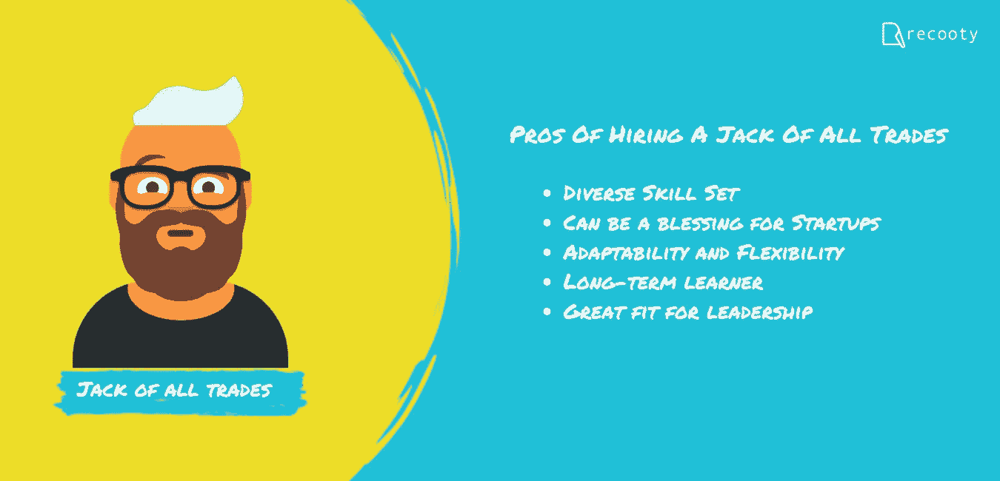
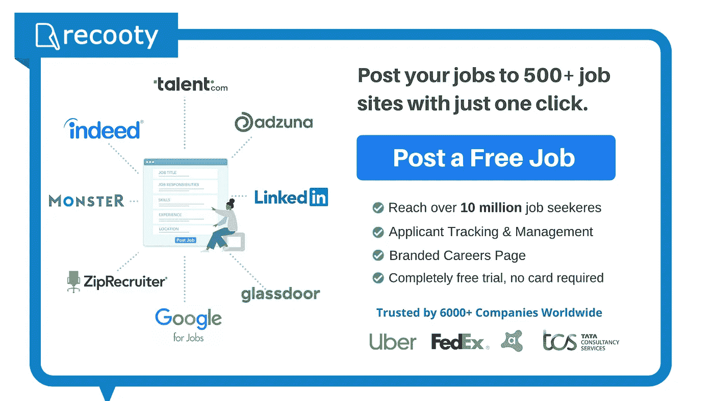

# 谁是更好的雇员，是百事通，还是一门学问的大师？

> 原文：<https://medium.com/swlh/who-is-a-better-hire-jack-of-all-trades-or-master-of-one-953cf6d46fe5>

Who is a Better Hire, Jack of all Trades or Master of One?

正如一个著名的比喻所说，“万事通，无所不能”，它基本上是指那些涉足许多技能，但不知何故在任何一个方面都没有专长的人。这个短语起源于罗伯特·格林在 1592 年用“万金油”这个词来形容从演员变成编剧的威廉·莎士比亚。17 世纪时，它被随意用作一种赞美的形式，直到“无主之物”一词被附加到它身上。然而，在过去的几年里，这个短语有了几种不同的形式。

*虽然旧词更常用于负面指代，但“百事通，一人之主”对传统的旧词来说有更多的正面含义。在招聘和雇用方面，这个短语最有可能被用来探究谁更适合一个行业，一个候选人是一个万事通，还是一个大师。当然，雇佣谁的优先权取决于行业的类型，但是在任何公司雇佣一个人的时候，有更多的方面需要关注。因此，最关键的问题仍然是，哪一个是更好的雇员，是百事通还是一技之长？这个问题在兜圈子，就像那句话。在本文中，我们将深入探讨与每种类型相关的一些基本但极其决定性的优点，这肯定会让您更好地了解谁更适合您的组织。*

# 雇佣多面手的好处:

Jack of All Trades

# 1.多样化的技能组合:

通常，一个拥有多种技能的人或一个万事通会因为这个短语的负面影响而被广泛地误解和曲解。有一种误解认为一心多用的人很可能会失败。然而，在批评这些人、他们的多才多艺和他们多样的技能组合时，一个非常重要的事实被忽略了。在今天这个竞争激烈的世界，大多数多面手都非常自信，并且精通他们所推销的任何技能。对于任何招聘者来说，雇佣这样一个多才多艺、多产的人总是一个双赢的局面。

# 2.对创业公司来说可能是一件好事:

鉴于金融资本和各种其他资源的有限可用性，初创公司可以真正利用多技能个人的潜力和能力。一个多技能的人可以做一堆任务。他可能会做一点编程，一点社交媒体管理，可能还会做数字营销。他也可能写博客和文章。因此，与其雇佣和投资多个人来完成不同的任务，不如雇佣一个人，这个人能高效地拥有并执行所有声称的技能，而且薪水还不错，这对创业公司来说是一个巨大的资源节约。

# 3.适应性和灵活性:

百事通可以有效地承担他们所接触到的各种工作和情况。获得一些技能最终会使他们足够熟练，能够充分利用他/她的技能集的每一个组成部分。这些人丰富的知识基础使他们能够灵活自如地从事体力劳动，就像坐在办公椅上处理数据一样。他们可能在工作中并不完美，但他们有能力做同样多需要做的事情，这样他们就不会对接下来的事情感到压力。

# 4.长期学习者:

作为一个万事通，个人不只是学习一件事。他们经历不同复杂程度和持续时间的多重学习过程。这无疑有助于他们获得任何人都可能拥有的最重要的技能——知道如何学习。万事通往往是一个终身学习者。他们总是保持对知识和学习的渴望，并不缺乏知识和可能性。

# 5.非常适合领导:

领导总是被认为经验丰富。一个几乎了解企业方方面面的领导者，肯定会比那些从基层升起来只做一项工作的人更有优势。在这种情况下，多面手非常适合领导角色。一个拥有多种技能的人可以有效地建立对其他员工的权威。

# 雇佣一个大师的好处:

Master of One

# 1.专业知识非常宝贵:

对于几乎每个行业的每个类别来说，在某一特定技能上表现出色并拥有专业知识的要求通常都是极其重要的。某一特定领域的专业知识是非常稀少的，因此，如果我们特别提到这个短语，精通某一领域的人会有巨大的优势。

# 2.生产力质量:

因为一个行业的大师是他所做的事情的专家，这确保了首先，他将在他的工作中非常富有成效，其次，他的工作很可能是完美的。因此，雇佣一个掌握某项技能的人不仅能提高工作的整体生产率，还能提高工作的准确性和效率。

# 3.也很容易变成千斤顶:

一个精通任何技能的人通常充满自信，渴望学到更多的东西。精通一项技能可以成功地转化为获得其他领域知识的催化剂，一旦一个人开始越来越多地了解某个领域的不同方面，他就会以某种方式成为万事通。

# 4.在培训和打磨中节省的时间

如果一个多面手类型的人受雇于一项需要一定水平的专业知识来保证质量的工作，那么将需要大量的时间和其他资源来训练他达到所需的专业知识水平和效率。然而，如果一个掌握一种技能的人被某项工作聘用，他就不需要培训，因为他已经是他所做工作的专家了。

# 结论:

如果你刚开始创业，资金和资源有限，多面手对你新成立的公司会很有帮助。然而，对于没有预算限制的知名品牌，大师可以非常有助于将他们的组织带到新的高度。

# 寻找免费的工作发布工具？

[**Recooty**](https://recooty.com/) 可以根据你的要求，既可以帮你聘请“百事通”，也可以帮你聘请“一专多能”。使用 Recooty 的[免费职位发布](https://recooty.com/free-job-posting)工具，以前所未有的速度雇佣优秀人才。

**招聘愉快！**

最初发布于:

[https://recoooty . com/blog/who ' s-a-better-hire-jack-of-all-trades-or-master-of-one/](https://recooty.com/blog/who-is-a-better-hire-jack-of-all-trades-or-master-of-one/)

## 这篇文章发表在 [The Startup](https://medium.com/swlh) 上，这是 Medium 最大的创业刊物，拥有+423，678 名读者。

## 在此订阅接收[我们的头条新闻](https://growthsupply.com/the-startup-newsletter/)。

