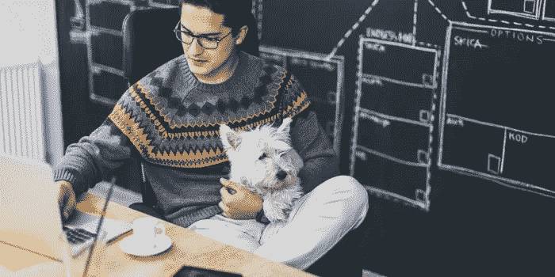

# 谁让狗进来的？

> 原文：<https://medium.com/swlh/who-let-the-dogs-in-a7044004b3c>

Pekic | Getty Images

## 提托的手工伏特加做到了。成功随之而来。

1997 年，当创始人蒂托·贝弗里奇(Tito Beveridge)决定将他的业余爱好业务转变为一家商业初创企业时，他的狗 Dogjo 就在他身边。

多乔常常是蒂托几天来与另一种生命形式的唯一接触，因为他要烹饪一批批产品，最终成为“蒂托手工伏特加”，装瓶并装载…