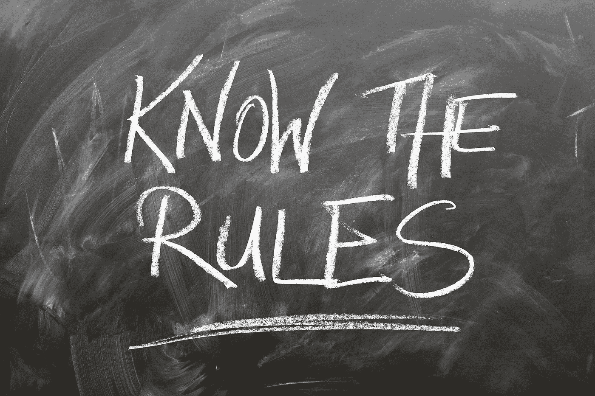

# 谁需要规则呢？

> 原文：<https://medium.com/swlh/who-needs-rules-anyways-a21338f7796f>

Very important! Or is it? Image by [geralt](https://pixabay.com/de/users/geralt-9301/) on [Pixabay](https://pixabay.com)

我们是否已经到了这样一个地步，好人不需要任何规则，坏人不在乎这些规则，愚蠢的人甚至不明白这些规则？

当我躺在附近森林中我最喜欢的草地上，思索着这个世界，我在想:

> ***规则管用吗？***
> 
> 我们甚至需要规则吗？
> 
> **为什么人们会遵守规则——或者说** …