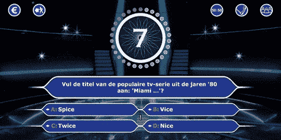
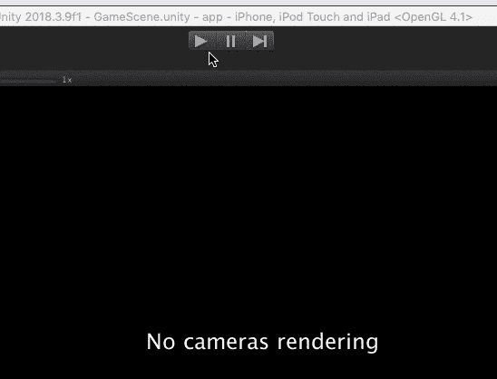
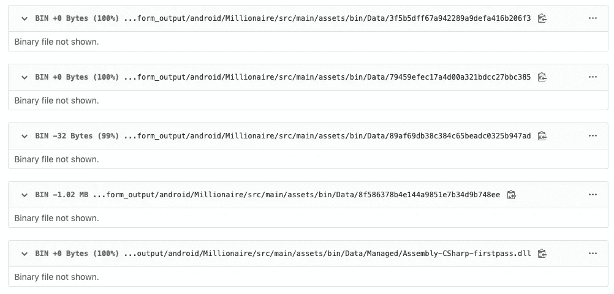
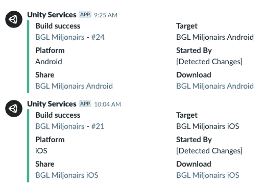
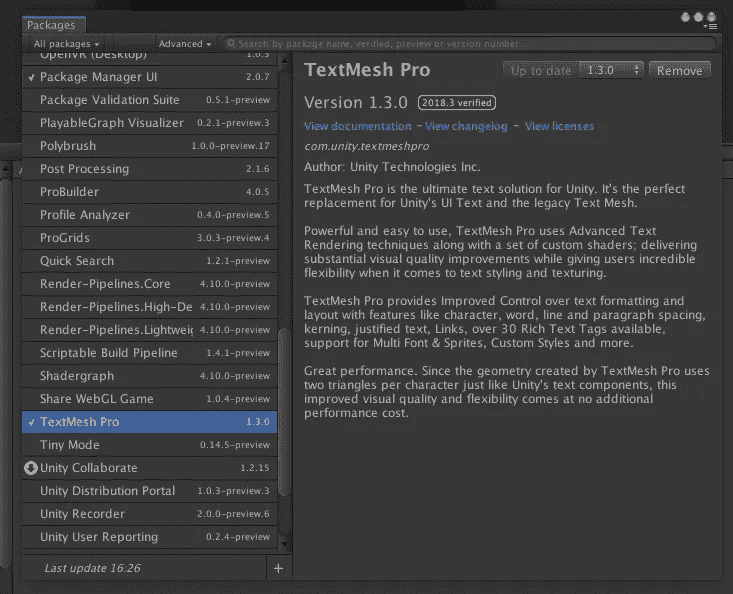
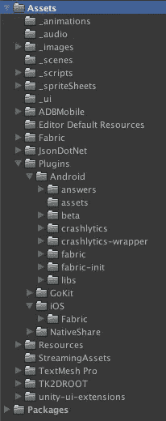
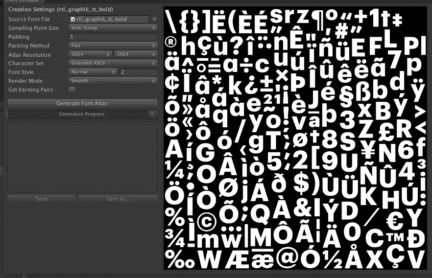
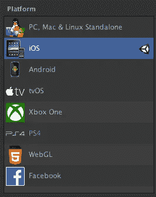
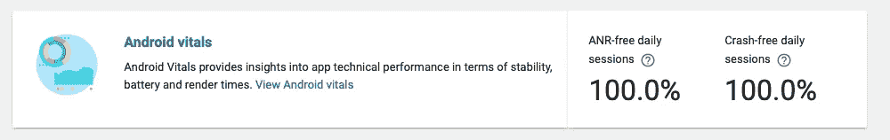
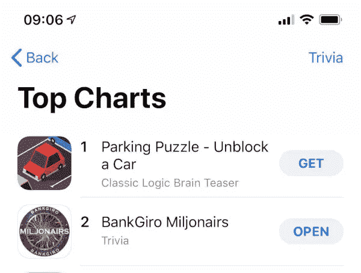

# 谁想成为 Unity 开发者？

> 原文：<https://medium.com/swlh/who-wants-to-be-a-unity-developer-8a5cd11868b6>

RTL·尼德兰邀请我们在 Egeniq 为他们的新电视游戏节目《T2》制作一个配套游戏。)。本文将总结我在开发这个应用程序时使用 Unity 的积极和消极方面。

这个游戏包含将近 2000 个问题，你必须在规定的时间内回答。你越快，你得到的分数就越多。随着你在奖金阶梯上的位置越来越高，难度也越来越大。游戏的视觉效果与电视节目非常相似:它本质上是一个 3D 渲染的 2D 游戏，给用户一种深度感(屏幕上的元素靠近或远离)。



Depth effects of the 2D object make the game a lot more immersive

## 了解项目

这部电视剧的游戏已经在一些市场上推出，RTL 从索尼那里获得了源代码的许可，所以大部分时间都花在了定制游戏上，使其看起来更现代，并扩展了一些小功能，如分享最终得分或用户处理。

当我在 Unity 中打开项目时，它问我是否要将我的项目迁移到我的 Unity 版本，因为它上次是在早期版本中编辑的。确认后，等待大约一分钟，应用程序就可以编译了。

应用程序的第一次编译可能需要一分钟左右，但之后的增量编译要快得多。在我修改了代码之后，按下大的 play 按钮，5 秒钟之内我就可以在编辑器中开始玩游戏了！不需要部署到任何设备，我可以调整预览窗口的大小，以匹配 iPhone 5S 或 iPad Pro 的屏幕大小。



Running the app in the editor within a few seconds

我的第一印象非常好，但是 Unity 的长期表现如何呢？

## 设置配置项

当我们想要将应用集成到我们的持续集成(和交付)工具 [Buildozer](https://buildozer.io/) 中时，第一个障碍出现了。Buildozer 不支持 Unity 项目(目前为止)，所以作为第一个解决方法，我只是在每个 pull 请求后导出 Android 和 iOS 项目，并命令 Buildozer 从包含导出项目的目录中进行构建。

这是可行的，但是导致了大量的开销——人工劳动和差异:我必须手动导出 iOS 和 Android 项目和每个拉请求，拉请求看起来主要是这样的:



A diff in the exported Android project. Not really useful.

此外，这些二进制文件中有很多会频繁更改，并且非常大，因此 git repo 的整体大小正在以惊人的速度增长。很快，将会有一个喝咖啡的休息时间来为其他人克隆存储库(或者 CI 工具)。
所以我不得不寻找一个替代方案。

因为我已经用这种变通方法实现了一个工作构建，所以我开始研究我们是否可以在签出后在 Buildozer 节点上自动导出项目。
[可以编写脚本](https://stackoverflow.com/a/33824986/1395437)，然后可以通过命令行调用它来导出项目。但是它有一个主要问题:它需要 Unity 可执行文件来调用，而 Buildozer Android builders 运行在 Linux 上，Unity 不支持它。所以我开始寻找其他选择。

然后我找到了 [Unity Cloud Build](https://unity3d.com/unity/features/cloud-build) 。这正是我所寻找的，它可以建立和分发(通过共享链接)从一个仓库建立的 Android 和 iOS 应用程序。定价页面非常具有误导性，他们说需要 Unity Teams Advanced，当你点击链接时，上面用大字写着你可以免费获得 Unity Pro 的团队 Advanced。从我们的经验来看，这是不正确的，因为尽管我们有一个专业帐户，但我们不能向云构建添加任何存储库，直到我们单独购买 Team Advanced(每月 9 美元是一个非常公平的价格，但仍然如此)。

我将我们的项目添加到 Unity Cloud Build 中，它在一个小时内就可以在两个平台上运行。它有它的怪癖，比如构建时间长和缺少功能([我不能删除我的旧 iOS 签名凭证，只能添加额外的凭证](https://forum.unity.com/threads/cloud-build-should-be-able-to-remove-edit-credentials.373029/)……)，但它完成了它的工作。



It even supports Slack notifications with integrated links for downloading the built products!

## Unity 如何处理多平台

大多数 Unity 的新人都很好奇该平台如何同时处理 iOS 和 Android。这两者在 API 和应用程序生命周期状态上有很大不同，我可以说 Unity 很好地抽象了这些。

默认情况下，您用 C#编写代码。你也可以使用 *async-await* ，你可能会经常用到，比如网络请求，或者只是等待动画结束。
对于常见的任务，Unity 有方便的方法。
要在浏览器中打开一个 URL，您只需调用:`Application.OpenURL(url);` 或播放全屏视频:`Handheld.PlayFullScreenMovie(“intro.mp4”, Color.black, FullScreenMovieControlMode.CancelOnInput);`

如果您需要平台上的不同行为，您可以使用平台指令:

```
#if UNITY_ANDROID
    data.Add("platform", "android");
#elif UNITY_IOS
    data.Add("platform", "ios");
#endif
```

但是，如果您需要与平台 API 交互，并且没有 Unity 便利包装器，该怎么办呢？幸运的是，您还可以通过 C#调用 Unity 和平台相关的 [Java](https://docs.unity3d.com/ScriptReference/AndroidJavaObject.CallStatic.html) 或 [Objective-C](http://blog.zhengdong.me/2013/09/13/using-ios-android-libraries-unity3d/) 代码上的方法，在它们之间进行互操作。

当你通过一个包导入一个插件时，它通常由 Android jar 文件、iOS 框架和 C#中两者的包装器组成，后者根据当前平台调用底层的 Android 或 iOS 函数。

## 包和构建脚本

关于包裹，我有一种复杂的感觉。它们不是真正的包，而是压缩在一起的目录和文件的集合。当您在 Unity 中打开包时，它会询问您是否希望将它们全部导入到项目中。所以现在你有一堆额外的源文件和资产文件来混杂你的项目。
还有，Unity [有很多*魔法目录*](https://docs.unity3d.com/Manual/SpecialFolders.html) 。如果你把一个文件放在`Assets/Plugins/Android`里，它只会被包含在 Android build 里(iOS 也一样)。如果你有一个名为`Editor`(项目中的任何地方)的目录，你可以创建一个特殊的 C#类，上面有一些注释，瞧，现在你在 Unity 的顶部工具栏中有了一个额外的菜单项！

我不得不承认，有时候这很方便。就像 Fabric Unity 插件在启动时崩溃一样，[你可以删除一个插件资源文件](https://stackoverflow.com/a/52036153/1395437)让它再次工作。这是一个权力越大责任越大的时刻。



The Unity package manager window. They also verify popular packages against the editor versions, and remind you if there’s an update available.

Unity 也知道这一点，他们越来越多地推动他们的包管理器。它有助于查找文件属于哪个包，列出包的已安装版本，并提供卸载属于插件的所有文件的能力，或更新现有版本。在我看来，这是应该走的路，但是大多数包都不是通过这个管理器分发的。Unity 应该更多地推动这一点，创作者通过 here 或资产商店进行宣传。



Plugin directories intermixed with code and asset directories in the project

还有一些特殊的类叫做构建脚本。它们是带有一些特殊注释的常规 C#类，这使得 Unity 在您构建应用程序后调用它们的方法，这时您可以在构建产品中移动和编辑文件。对于大型项目来说，它们是必不可少的，因为迟早你会需要编辑一个 plist，或者将一个文件移动到不同的路径。

我的第一个任务是让游戏在 Android 上运行(之前只在 iOS 上运行)。当您在 Android 上运行它时，它会在第一次数据库操作时崩溃，因为它找不到 *libsqlite3* 。
解决方案似乎包括预编译的 *libsqlite3.so* ，并将其放入一个神奇的目录中，该目录只将它添加到 Android 版本中。
当项目中包含库时，这些包含神奇目录和构建脚本的工作区曾经是常规的。

## 图书馆💔一致

我已经提到过我必须应用一个变通方法来让 Fabric 插件在 Unity 中工作(除此之外，它工作得很好！).可悲的是，这似乎是库之间的一种模式，他们倾向于放弃 Unity 支持(或者至少，不再更新他们的包)。

例如，Adobe Mobile Analytics 自 2016 年 10 月以来就没有更新过他们的 Unity 包。您需要应用一些变通方法(包括 2 个后期构建脚本)来让它正常工作。我在这个要点中列出了这些[，以帮助人们尝试做同样的事情。](https://gist.github.com/dzolnai/1de788bba86ff4b52b5fc261b4312169)

如果你认为你可以避开插件，那你就错了。例如，Unity 支持将 JSON 从文本序列化为对象。遗憾的是，这只是一个非常基本的实现，因为它不支持映射别名，它只能将 JSON 键匹配到完全相同的变量名。
所以当你有一个带破折号 *(-)* 的 JSON 键或者它以一个数字开头时，你必须切换到一个库来解决这个限制(我强烈推荐 [JsonDotNet](https://assetstore.unity.com/packages/tools/input-management/json-net-for-unity-11347) )。
或者如果你只是想[分享一个点击按钮的文本](https://assetstore.unity.com/packages/tools/integration/native-share-for-android-ios-112731)，你最好使用插件，因为你自己写同样的代码可能要花上几天。

现在，让我们开始视觉效果。游戏元素是与 2D 工具包一起构建的。当我在做这个项目的时候，上一个版本已经有 2 年了，并且在 Unity 的稳定版本上出现了问题。幸运的是，它没有破坏应用程序，只是使编辑文件变得更加困难，我看到现在有一个新的版本可用，它承诺与较新的 Unity 版本兼容(但它仍然落后一个主要版本)。

## 使用 2D 工具包显示元素

你可能已经知道，Unity 使用 OpenGL 将游戏绘制到你的屏幕上。要将图像或文本放到屏幕上，你不能只是将它们拖放到屏幕上(你可以使用面板，但那些只是用于 UI，不建议用于游戏)。使用 2D 工具包，要将你的图像显示在屏幕上，你首先要将它们编译成一个精灵集合。您选择所有想要包含的图像，然后将它们编辑在一起。在后台，这将创建一个名为*图集*的特殊 PNG 文件，其中包含所有拥挤在一起的图像。


This is how an atlas looks like - notice that it even rotates the images to make them fit better together

现在，如果你创建了一个精灵，你可以从图集上查找图像。在游戏中，这个地图将作为 OpenGL 纹理加载，需要时将从其中剪切出单独的精灵。

当你用 2D 工具包实例化这些精灵时，它们都有一个游戏对象。GameObject 是我在游戏过程中互动最多的对象。使用它的 transform 属性，我可以修改它的位置、旋转、缩放甚至颜色。当你删除游戏对象时，它也会从屏幕上删除。

如果你想显示文本，那也不像看起来那么简单。你必须将你的字体编译成一种所谓的有符号距离场格式，这种格式将你的字体转换成包含你字体中所有字母、数字和特殊字符的图像集。因此字符也从纹理映射回来。因为你的字体不再是矢量格式，如果你把字体放大太多，质量损失将会很明显。所以你必须用更大的单个图像尺寸来保存它，但这又会导致更大的应用程序尺寸。



Preview of a font atlas, with the different settings you can choose: if you increase the resolution, the quality gets better at the cost of the size on the disk taken by the atlas

## 构建应用程序

最后，如果您在编辑器中一切正常，那么是时候测试并部署到您的应用程序设计运行的物理设备上了。Unity 支持广泛的平台选择，这使得如果你想写一个游戏，并把它分发给尽可能多的人，这是非常有吸引力的。



A broad selection of platforms

对于 Android，您可以通过两次点击来构建一个. apk，或者导出到一个 Gradle 项目，您可以在 Android Studio 中打开该项目。iOS 选项创建一个 Xcode 项目，然后您可以在其中归档产品(注意，您也可以为模拟器构建，但是首先您需要将目标 SDK 设置更改为 Simulator)。

一旦建成，我注意到。apk 和。ipa 在尺寸上相当大，这是因为 2D 工具包图集文件非常大，并且消耗大量空间。这可以在未来通过花时间[优化图集](https://www.2dtoolkit.com/docs/2.4/advanced/sprite_optimizations/sprite_optimizations.html)，或者[纹理压缩设置](https://docs.unity3d.com/Manual/class-TextureImporterOverride.html)来改善。

一旦应用程序对公众可用，我们注意到 Unity 的崩溃率非常低(大约 10.000 次会话中有 1 次，这对第一个版本来说真的很好)。我对此非常高兴，因为没有人想用最少的堆栈跟踪来调试解释过的 C#代码中出现的问题😊



Every Android developer’s dream

在 iOS 上，我们第二天就获得了如此多的下载量，以至于它在发布后的第二天就跃升到了同类产品的第二名！



#2 in the Trivia category on the App Store

## 摘要

对我来说，与 Unity 一起工作既有趣又令人沮丧。当你添加一个新的插件，或者想更好地了解 Unity 的一个特性/工具时，一开始是很乏味的，因为文档和“StackOverflow 支持”不如 Android 或 iOS。但是一旦你让它工作了，它的工作会出乎意料的好。

最终，编辑器、iOS 和 Android 以完全相同的方式渲染，速度和质量都很好，就像它们应该的那样。

看到移动跨平台已经走了多远是很有趣的，Unity 肯定是一款游戏要考虑的因素。虽然我不能确定它在真正的 3D、计算和渲染密集型游戏中表现如何，但工具和功能并没有让我不满意。

*如果你居住在荷兰，可以在* [*安卓*](https://play.google.com/store/apps/details?id=nl.rtl.miljonairs) *或* [*iOS*](https://itunes.apple.com/us/app/bankgiro-miljonairs/id1463171878?ls=1&mt=8) *上随意尝试游戏。*