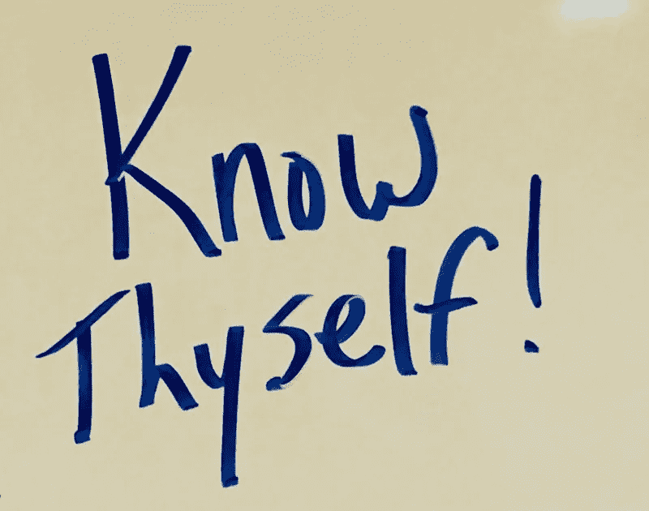

# 你是谁就是你如何领导

> 原文：<https://medium.com/swlh/who-you-are-is-how-you-lead-a383b464793e>

组织的领导者不成比例地影响文化和员工体验。然而，领导者没有花足够的时间去了解他们是谁。我的意图不是反对领导者需要的操作性和适应性技能发展(又称软技能)，而是强调了解自己的重要性，因为这与成为一名有效的领导者有关。

在《哈佛商业评论》的一篇文章中，塔莎·欧里奇博士分享了以下内容:

> “……尽管 95%的人认为他们有自我意识，但实际上只有 10%到 15%。”

组织需要投资帮助他们的领导者和员工更好地理解他们是谁，这样他们才能成为更好的领导者。如果没有这种批判性的洞察力，我们的领导人将会是善意的，但会遭受自我保护和自我纵容，而不是有效的。糟糕领导的代价是什么？所有这些意想不到的后果造成了什么

我们可以从以下几个方面着手:

1.  优势:积极的组织心理学不是无足轻重的东西。我们总是从赤字的角度出发，这是怎么做到的呢？因此，为什么不开始考虑优势，以及如何利用优势来满足需求。如果你没有考虑过自己的优势，那么马上把它们背出来就不容易了。识别并拥有我们的优势需要练习。
2.  风格:就工作、交流等风格而言，我们知道自己天生倾向于什么吗？？如果没有，那么我们就在为误解和不可避免的冲突做准备。像 Everything DiSC 这样的工具是探索个人偏好和倾向的绝佳方式，以便更有效地沟通和领导自己和他人。通用语言是关键，所以无论使用什么工具，都要保持一致，否则你将会建造一座巴别塔。
3.  无意识偏见:我们都有，所以我们需要开始谈论它们。他们从哪里来的？他们如何影响我们的决策和我们领导的人？我们做了什么来支持我们的领导者减少无意识的偏见？
4.  个人盲点:盲点不是证明不良行为然后说“我不知道”的出狱自由卡。作为领导者，我们必须找出自己的盲点，让周围的人参与进来，尤其是我们的直接下属，这样才能成长为更好的领导者。像无意识的偏见一样，我们都有盲点，领导者的责任是了解它们并克服它们。
5.  个人局限信念:我们交谈最多的人是我们自己。我们与自己的许多对话向我们揭示了我们有限的信念。你的哪一部分在告诉你一个弄巧成拙的故事？我们探索过这是从哪里来的吗？它如何影响我们的职业生涯和个人生活？

要成为人们想要追随的领导者，组织和领导者需要投入了解你自己的努力。工作不是社交俱乐部或治疗师，但这并不意味着我们不应该有意创造时间和空间来做好领导者所需的自我工作。如果你是一个想要对你的发展进行有意投资的领导者，请联系我，edward@measuredleadership.com，我很乐意与你联系。