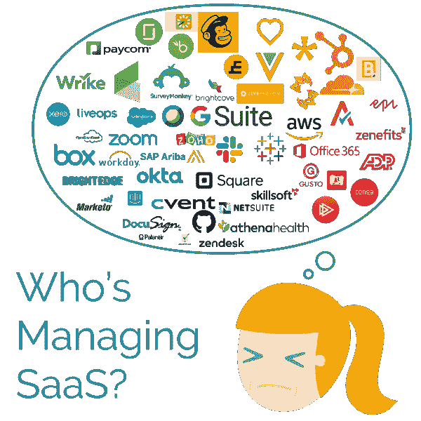

# 谁在管理 SaaS？与企业连续性专业人员的讨论

> 原文：<https://medium.com/swlh/whos-managing-saas-a-discussion-with-enterprise-continuity-professionals-14bbfc780e4e>

当 SaaS 提供商遭遇违规或其他灾难导致重大损失时，会发生什么情况？

不清楚是否有人会做好准备。

我们在[连续性专家协会](https://acp-international.com/)的科罗拉多州分会讨论了这个问题以及更多内容。

我们以围绕我们在客户中遇到的一些[影子 IT 恐怖故事](https://alpin.io/blog/shadow-it-problems/)做一个小测验开始我们的时间。

从那里，您可能会震惊地得知，一屋子的灾难恢复和业务连续性专业人员根本不知道**如果 SaaS 的主要供应商出现中断，那将是灾难性的。**

据我所知，没有人说他们曾经花时间为 SaaS 供应商制定应急计划，无论他们是否运行关键任务应用程序。

房间里的感觉？

他们的领导层和管理层认为，如果供应商在云中运营，那么他们“不需要担心”

值得庆幸的是，这个由敬业的专业人员组成的团队发现这些信息令人大开眼界，他们意识到在云时代改变做事方式的必要性。

## 你见过任何主要的云提供商的灾难计划吗？很少有人见过

如果你不知道 SaaS 供应商在灾难中计划做什么，当他们的灾难变成你的灾难时，你能告诉你的客户什么？在这种情况下，你可能只能重复云供应商告诉你的话。这将如何影响客户对您的弹性的看法？

我们都在继续向云迁移，但在业务连续性、安全性甚至数据备份方面，我们似乎正在重复同样的错误。您知道主要的云提供商不一定会备份您的数据吗？

无论我们接下来学到(或重新学到)什么，它们都可能是非常痛苦的。

请记住，如果您没有看到我们关于 SaaS 趋势的帖子，首席信息官们正在将云预算翻倍，并越来越多地考虑将关键任务应用转向云。

## 谁在管理 SaaS？Alpin 客户！

一些组织看到了 SaaS 的问题，并正在做出反应。公司使用 Alpin 是因为他们需要了解生态系统中所有的 SaaS 应用，而不仅仅是那些昂贵的应用。

为灾难做准备并不是唯一的目标。我们的客户还希望削减成本、防止安全漏洞或获得潜在数据泄露的通知。

是的，有超过 40K 个 SaaS 应用程序可供员工使用，管理所有这些应用程序似乎令人生畏。Alpin 可以帮助您从杂乱的信息中抽身出来，知道哪些应用程序最重要，包含最敏感的信息，或者最有可能导致违规。

如果您希望更加认真地对待 SaaS，我们有十多种方法来发现您的环境中存在哪些应用程序，以及财务、合规性和安全管理工具。联系我们观看 10 分钟的演示。你会看到 Alpin 如何为你工作。通过发送电子邮件 info@alpin.io 开始。

## 这篇文章发表在 [The Startup](https://medium.com/swlh) 上，这是 Medium 最大的创业刊物，拥有+434，678 名读者。

## 订阅接收[我们的头条新闻](https://growthsupply.com/the-startup-newsletter/)。

