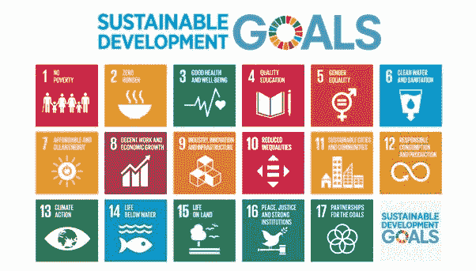

# 为什么 2019 年对影响力投资来说是重要的一年

> 原文：<https://medium.com/swlh/why-2019-is-an-important-year-for-impact-investing-6bee1fd24967>

社会影响投资(SIIs)、ESG 或影响投资旨在实现两件事:

1.  社会目标
2.  财务报告

**影响力投资**这个术语相对较新，可以追溯到 2007 年意大利洛克菲勒中心，当时几名从业者聚集在一起定义一种新的投资方式，能够产生不仅仅是财务回报。

从那时起，政府组织、非政府组织和金融机构都在讨论和使用这种投资方法。

# **那么，影响力投资的热门话题是什么？**

它确实改变了投资管理和慈善事业，尤其是在过去十年。

投资可以面向社会倡议或整体社会事业。

现在，你可以创建和定制你的投资组合，以反映你深深关心的事业。

在你的投资组合中，有一些潜在的投资，你会发现它们的商业实践的公司摘要，以及它们的影响摘要，概述了你对它们的基金或业务的投资将解决这个社会问题。

# **重要立法**

时任美国总统巴拉克·奥巴马于 2012 年将《就业法案》签署成为法律，这是一项具有里程碑意义的法律，允许小额投资，取消了古老的行业最低限额。

Source: United Nations

2015 年，联合国与 197 个会员国就 2030 年前实现 17 项可持续发展倡议达成一致，也被称为“联合国 2030 议程”。

# **这很关键，原因如下:**

*   它为各组织、非政府组织、中央非营利机构和政府机构等建立了一个适当的框架和指导方针，以努力实现这些倡议。
*   千禧一代已经开始意识到，随着他们的成长，社会和世界问题将成为首要问题，直接影响他们的生计。
*   千禧一代，甚至 Z 世代都关心采取主动，产生直接的社会影响，直接影响他们的购买决策。
*   由于购买决策现在更具有社会意识，因此投资解决方案也是如此。
*   千禧一代和年轻一代希望投资于他们相信的事业，这导致金融机构开始关注提供这些投资解决方案。
*   这很重要，因为千禧一代正在职业生涯中走向成熟和进步，随着老一代人退休，商业、营销、采购和投资决策将严重关注这一代人。

# **成长**

根据美国 SIF 的数据，影响力投资从 2012 年到 2016 年增长了 135%，2016 年到 2018 年增长了 38%。

# **影响力投资神话**

影响力投资曾经被认为是一种投资方式，你必须“牺牲”投资回报来获得社会影响，这一点现在被彻底揭穿了。

事实上，从 1990 年 5 月到 2018 年 3 月，摩根士丹利资本国际 KLD 400 社会指数(衡量社会责任投资(SRI)的指数)每年跑赢标准普尔 500 指数 0.5%，包括股息。

这种投资方式的预期增长将在未来十年继续增长。

2019 年标志着这十年的最后一年，这一年将真正考验影响力投资计划，以及机构在实现这 17 项可持续发展计划方面的意愿。

*最初发表于*[*【www.quora.com】*](https://qr.ae/TUvVfo)*。*

## 这篇文章发表在 [The Startup](https://medium.com/swlh) 上，这是 Medium 最大的创业刊物，拥有+418，678 名读者。

## 在这里订阅接收[我们的头条新闻](http://growthsupply.com/the-startup-newsletter/)。

