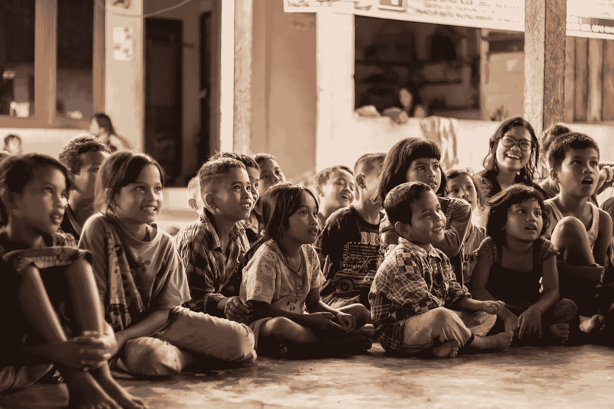

# 为什么 30 岁及以上转行如此艰难

> 原文：<https://medium.com/swlh/why-a-career-change-at-30-and-beyond-is-so-hard-120e7c72d697>

It 不用算法就能意识到转行真的很难。我们害怕这个想法。随着时间的流逝，这种畏缩会变得更糟。如果你想在 30 岁以后改变你的职业生涯，你将需要你能得到的所有运气，因为这真的很难*。但这不是不可能的*，这是你可能会忘记的关键区别。然而这是你放弃的最大原因；这看起来太难了，你甚至不想反抗。**

**在我们开始之前，让我们回顾一下过去。我想让你想想你生命中一段令人畏缩的时光。就像，因为极度的痛苦而畏缩，只是在你的脑海中重温它。超级尴尬或羞辱的事情。我知道你有这个能力。基本上，你摇头的东西，并希望永远不会在你的生活中再次经历；一次就够了，光是想到它，你就真想爬进洞里，在一块琥珀板上变成化石。**

**所以你现在已经开始了一段可怕的回忆之旅。情况糟透了，没有其他的说法。总的来说，我大概能说出几个我们像这样陷入困境的常见场景。**

**你可能听说过人们是如何把对公开演讲的恐惧置于死亡之上的。我真的不打算在这里花时间去想为什么人们会把公开演讲放在死亡的终结之上，但是让我们继续假设这是真的。如果是这样，我坚信转行是正确的。我知道这是一个大胆的声明。话说回来，说你宁死也不做公开演讲。**

**但我不仅仅是从我的屁股里拔出来的。关于压力的研究表明，换工作会让大脑认为你在威胁它的生存。事实上，福尔摩斯-拉赫生活压力调查将转行列为生活中最有压力的 20 件事情之一。显然，这是紧接着一位密友死亡之后的[。根据科学研究，转行的压力比失去一个亲密的朋友要小得多。](https://www.stress.org/holmes-rahe-stress-inventory%20)**

**综上所述，很明显，决定进入职业转换的深渊会把人吓得屁滚尿流。压力很大的原因有很多:未知的财务因素，你是否会喜欢它，你是否会后悔，等等。**

**但是到了某个时候，你目前工作中的痛苦占据了你的心，并且挥之不去。它紧紧抓住你的脖子，每隔几个月就会越来越紧。这种感觉很糟糕。**

**那么，为什么 20 年后我们会发现自己从事同样的职业？更好的是，我们当初为什么会沦落到这种糟糕的职业？如果我们第一次就做对了，生活会简单得多。但有趣的是，生活本不应该是一帆风顺的。**

# **一段简短的历史，说明为什么你一开始就选择了错误的职业**

**每个幼儿园老师都喜欢在新学年开始时问学生同一个问题:**

> **“你长大后想做什么？”**

**它很可爱，因为它让我们小小的豌豆大小的大脑变得狂野。正如他们所说，世界是我们的。这里没有审判，因为我们不知道审判是什么样的。你看到外面所有最酷的东西，认为它们会是令人敬畏的职业。金钱、声望、比较和判断都不在考虑范围之内。当史密斯夫人听到班上的每个学生，包括你在内，畅所欲言时，她脸上露出了最大的笑容。不管咧嘴笑是真正的快乐还是狡猾的笑，因为她知道我们长大后都完蛋了，她鼓励你的童话。**

****

***The innocent look we get fooling ourselves into thinking we’ll do what we want in life.***

**在整个小学阶段，你用你的小手抓住你的视觉。然后中学就开始了，我们接触到了一些生活的毒素。也许我们的理想职业从幼儿园开始就改变了，但谁在乎呢。我们已经不再需要担心它了，我们不需要。高中时光一去不复返，越来越多的毒性通过潜移默化的方式渗入到我们原始的泡泡中。我们已经学会了什么是比较的艺术，如何判断，以及如何成为一个十足的小混蛋。**

**更有可能的是，你的理想职业已经改变了，但还是那句话……你并不太担心。你只是担心过不了学校，向父母要钱，想叛逆，想清楚自己想考哪所大学。最终，你会发现最后一个。你拿到了录取通知书，然后就出发了。**

**现在开始肮脏的介绍如何悲惨的职业生涯开始。**

**大学二年级还没结束，就要申报专业了。尽管你很想填写“我不知道”，但你不能。但是真的，你不知道你他妈的想做什么。你一直过于关注两件事情中的一件:参加聚会和尝试 18 种低质量的杂草，或者取得好成绩，希望你的未来看起来很光明。**

**不管怎样，你已经参加了太多的随机课程，但是没有一门是你真正感兴趣的。你希望你能主修普通学科，但是你的学校职业顾问摇摇头。你的第二个最佳选择是希望你能主修艺术史或哲学。那些课看起来很酷，这仅仅意味着你没有在琼斯教授的课上睡着。但是你的父母也结束了这一切。*“买些实用的东西。”*是每一个关心你的高等教育的父母的座右铭。“弄点实用的”就是“弄点赚钱的。”不能怪你的父母。他们不愿看到自己的孩子挨饿。更有可能的是，他们不想成为你的私人银行。**

**所以考虑到这些，你最终选择了一个你并不真正感兴趣的专业，但却满足了你的父母和你大脑中实际上通过逻辑思考的[部分。你认为你以后会明白的。*提示:你真的不知道。*](https://www.hopkinsmedicine.org/neurology_neurosurgery/centers_clinics/brain_tumor/about-brain-tumors/how-the-brain-works.html)**

**一旦大学毕业，你已经拿到了学位，欠下了五位数的债务，却不知道从哪里开始找工作。当然，你能做的最简单的事情就是从你的专业开始，假设你没有获得艺术或人文学科的学位。因为，你知道，那是你被雇用的最好机会。你觉得没什么大不了的，如果你想在 30 岁之前转行，你有足够的时间来解决问题。**

**没那么快。**

# **为什么我们会陷入糟糕的职业生涯**

**快进一点，你终于在你主修的后学院找到了一份工作(如果你幸运的话)。现在好戏开始了。**

**你的大脑告诉你两件事:**

1.  **没关系，我会考虑一下这个职业，然后决定它是否适合我。**
2.  **我现在在赚钱。我有债要还。我有社会义务。我需要这份工作。**

**事情开始变得棘手了。你的大脑告诉你的那两件事？他们之间有直接的冲突。一方面，你想确定你的工作是否适合你。你喜欢你的同事吗？你喜欢这份工作吗？你想坐在那里开枪自杀吗？另一方面，这是一笔稳定的收入，钱正以创纪录的速度从你的账户中流出。债务和无用的垃圾如酒吧标签会让你这样做。不管怎样，你需要知道每两周，你不会看着你的银行账户哭泣。**

****

***Where (more than) half of your money goes in your 20’s.***

**在开始大学毕业后的成人生涯后不久，你开始有了这样的想法:你在自己的地方并不真正快乐。调情变成了唠叨，而且随着时间的推移越来越糟糕。然后，到你 30 岁的时候，你可能会在走出否认阶段后意识到一件非常明显的事情:你没有从事你喜欢的工作。很有可能，你没有从事你喜欢的职业。正因为如此，你在[遭受不必要的痛苦](https://mondayviews.com/suffering-in-life/)。**

**简单的数学表明有一个简单的解决办法:你走开，找到你*喜欢做的事情。但是正如前面提到的，生活并不简单，对吗？你不会放弃那份糟糕的职业，因为你还没有准备好做出更明智的选择。我不怪你。在 20 多岁的时候，我们真的没有选择正确职业所需的知识，更不用说 30 多岁的时候了。这需要很多令人感动的东西:了解你自己，你的优势和劣势，你的价值观和目标，等等。这是一个复杂的等式，没有放之四海而皆准的解决方案。***

**同时，你的责任也增加了。你可能有一个家庭/孩子/一个重要的人要照顾。你有汽车付款。你有房子抵押贷款。妻子说小汤姆需要上私立学校，因为公立学校系统是为农民准备的。这是大多数人的生活，30 后。**

**最后，你多少摆脱了对职业的否定，现在你想找一份自己喜欢的工作。但是你被困住了。你被卡住了。你很可能会被困住了。**

**但你是吗？值得吗？让我们来看看它所造成的损失，以及背后的数字。**

# **过了 30 岁还呆在糟糕的职业生涯中会对你造成多大的伤害**

# **职业幸福项目**

**对幸福的追求无处不在。有人告诉我们，如果我们做 X，Y，Z，我们就会到达那里。我们假设如果我们找到了完美的职业，它会回应我们对纯粹快乐的祈祷。**

**不幸的是，事实并非如此。幸福不会出现在你家前廊的复活节篮子里。但情况会变得更糟:如果你停留在一个糟糕的职业中，你的快乐和心理健康会直线下降。为什么？幸福是通过做让你满意的事情找到的。拥有一份每周花 40 个小时，外加开车时间的糟糕工作，并不能带来成就感。**

**有没有可能在一个糟糕的职业生涯中仍然很快乐？不。有可能在平庸的职业生涯中仍然快乐？是的。但是怎么做呢？好吧，如果你能设法把你的职业和你的身份分开，把你 100%的空闲时间花在让你充实的项目/爱好/事情上，这是可能的。但是真的真的很少。因为说实话。我们不会把所有的空闲时间都用来做有意义的事情。我们的保险公司要续保了，我们想要更便宜的费率。我们医生的预约安排在明天。这样的例子不胜枚举。**

**还有另一面。你能在一个看似完美的职业生涯中(不要在这里拿自己开玩笑)，仍然不快乐吗？当然了。我肯定这种事经常发生在人们身上。生活不仅仅是工作。尽管它占据了你生活的很大一部分，但它并不一定能定义你。是吗？**

**谈到职业，这个世界上有两种人:一种人需要工作成为他们身份的一部分，另一种人可以在工作中取得成功，但同时却不在乎，一直在工作之外定义自己。你通常非此即彼。我是前者，但我知道很多人是后者。两者都没有错。**

**走向幸福的第一步是弄清楚你是哪一种人。它使朝着一个方向前进的过程变得容易得多。相信我。近十年来，我试图说服自己是后者——我可以做一份糟糕的工作(主观的),只要我找到了很酷的爱好和朋友，我的余生都会过得很好。我没走多远。**

**重要的是，要么找一份给你目标感和成就感的工作(如果你把自己的身份和职业联系在一起)，要么在工作之外寻找爱好、活动和满足感(如果你能把两者分开)。**

# **职业数字**

**如果你需要了解留在糟糕的职业中会有什么后果，看看这些数字吧。为了这堂你不想上的数学课，我像你九年级的代数老师一样督促你，假设平均法则——你是一个普通人，做着普通的工作，按照美国人对普通周的定义。郑重声明，普通人没什么不好。**

**假设你 30 岁了，在某个时候你想转行。假设你上了大学，21 岁开始工作，这意味着你已经在这份工作上花了 9 年时间。假设你从周一到周五都在工作，那就是 2340 个工作日。468 周的工作。还需要一个提醒吗？18720*实际*小时在一份蹩脚的工作中度过，多少有些痛苦。或者如果你幸运的话，只是有点痛苦。**

**美国的平均寿命是 79 岁多一点。准确地说是 79.3，但我们这里就用 79。这意味着你还有 49 年的工作时间，假设你一直工作到你死去的那一天。这相当于实际工作 12，740 天(再次假设 M-F)。再假设你一周工作 40 个小时，那么你的工作将花费 101，920 个小时。**

**即使你觉得到目前为止已经浪费了很多时间，也还有很多时间。快讯:你确实浪费了很多。但好消息是你面前有很多人，你可以[开始追逐你想要的东西](https://mondayviews.com/stop-chasing-others/)。现在想象一下，如果你陷入了一个糟糕的职业，而*在你的余生中没有改变。你浪费了相当于 120，640 个小时的时间坐着，做一些你非常讨厌的事情，你很容易放弃它，然后被 10 个萨摩亚人用湿面条在桑拿房里鞭打。***

**这真的不是你从小到大认为你会屈尊做的事。也不应该。**

# **转行难吗？**

**当然了。如果很容易，我们都会有一份完美的职业。不幸的是，事实并非如此。如果是的话，我们可能早在 30 年前就登上了火星，根除了人类已知的各种疾病，并终止了这个我们称之为地球的可爱地方的所有危机和冲突。**

**但是，唉，人们很痛苦，很大一部分是因为花了太多时间做你绝对不能忍受的事情。你知道，这种东西你可以轻易放弃，让 10 个萨摩亚人在桑拿房里用湿面条鞭打。**

**错误的生活方式。是时候改变了。**

***感谢阅读！最初发表于***。****