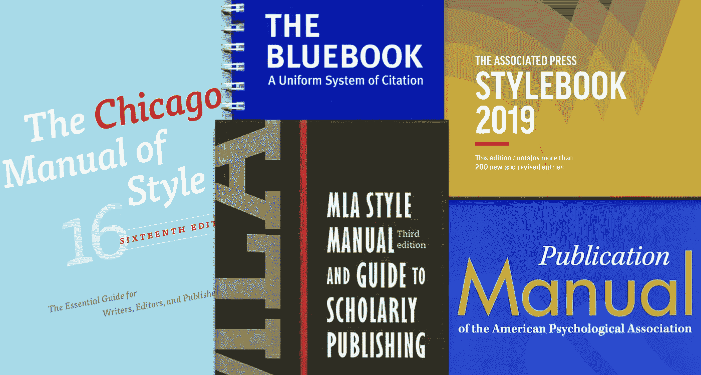

# 为什么时尚指南是一门好生意

> 原文：<https://medium.com/swlh/why-a-style-guide-is-just-good-business-da8058235f17>

你的公司或部门有风格指南吗？它可以像一个术语列表一样简单，也可以像一本书一样充实，但是一个好的风格指南可以提高你的组织的效率，提升它的形象，甚至增加它的利润。

> 公司书面材料的一致性是其品牌的一部分。

## 什么是风格指南？

风格手册，或风格指南，描述了一个组织在准备文件时决定遵循的规则。无论是为员工、客户还是公众而写，公司的文档都是其身份的一部分。这也是[苹果有风格指南](https://help.apple.com/applestyleguide/)的原因之一。公司书面材料的一致性是其品牌的一部分。

一个风格指南可能会告诉你哪些术语要大写，哪些首字母缩写要拼出，以及是否使用[所谓的序列(或“牛津”)逗号](http://www.quickanddirtytips.com/education/grammar/oxford-comma-pictures)。它可以指定特定产品、服务或程序的专有名称。它可以描述公司拥有的任何商标的正确使用。例如，百事可乐有一个专门针对品牌视觉识别的指南，包括不同版本标识的具体指南——颜色、字体、大小。

> 如果你雇佣合同作家或设计师，风格指南可以减少修改和来回的时间，这可能会大大增加项目的成本。

## **时间就是金钱**

风格指南可以提高员工和管理层的效率。如果你的公司经常小写“互联网”或连字符“回溯测试”，你的风格指南将包括这些项目，所以同样的决定不必一遍又一遍。当你雇佣一名新员工时，除了你的政策和程序手册之外，你还可以给该员工一套书面的指导方针，用于所有的书面交流，这样可以减少培训时间。

如果您与合同作者或平面设计师合作，能够提供您组织的风格指南副本可以减少问题和修改，减少来回的时间，这可能会增加项目的成本。

> 一致性传达了真正的专业人士对细节的关注。

## **提升你的形象**

清晰、一致的文字有助于树立一个有能力的组织的形象。如果你的公司有时和“顾问”一起工作，有时和“顾问”一起工作，你可能会显得不专业或粗心大意。(根据*韦氏词典大学词典*，两个拼写都不正确；使用其中一种，但要保持一致。一致性传达了真正的专业人士对细节的关注。

[中情局的风格手册](https://www.theguardian.com/world/shortcuts/2014/jul/09/cia-writers-guide-leaked-online)(全文可得[此处](https://fas.org/irp/cia/product/style.pdf))明确指出该机构的成功运作“在很大程度上取决于清晰、简洁的文字”此外，当书面材料必须由一群人准备时，风格指南可以帮助团队实现统一的基调。

> 每个行业都有自己的术语，因此组织通常会用自己的内部风格指南来补充或替换现有的已发布手册。

## **选择风格指南**

一个组织可能会采用一个广泛可用的已出版的风格手册，不同的领域倾向于使用特定的指南。在美国，大多数报纸都遵循美联社的样本。贸易和大学图书出版商倾向于使用*芝加哥风格手册*(既有[印刷本](http://www.press.uchicago.edu/ucp/books/book/chicago/C/bo25956703.html)也有[在线订阅本](http://www.chicagomanualofstyle.org/home.html))。社会科学青睐*美国心理学协会* ( [APA 风格](http://www.apastyle.org/manual/))出版手册。法律出版物使用蓝皮书。

因为每个行业都有自己的术语，许多组织用自己的内部风格指南来补充或替换这些已发布的手册。联合国有自己的风格指南，石油工程师协会也有。

无论是大型研究机构的文档部门、公司的营销部门，还是小型非营利组织，每个组织都应该以书面材料的清晰性和一致性为目标。一本好的风格指南不仅仅是参考书；这是一个重要的商业工具。