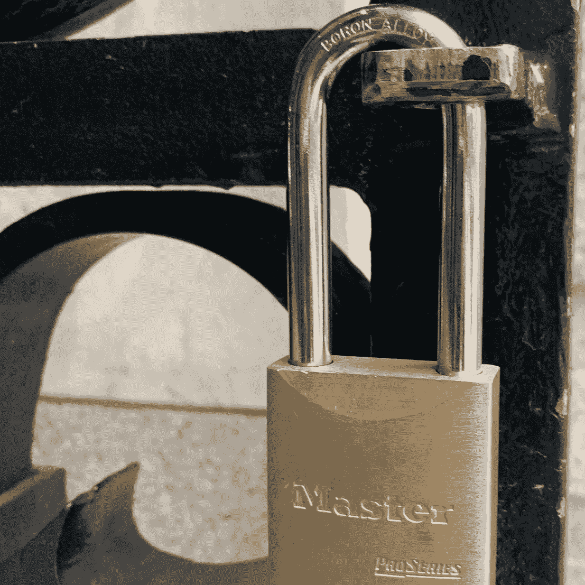

# 为什么脸书大火？因为这是最愤世嫉俗的平台

> 原文：<https://medium.com/swlh/why-all-the-facebook-fire-because-its-the-most-cynical-platform-883b1261c244>

*与泰门·克莱恩一起写的*

在[最近的一篇专栏文章](https://www.nytimes.com/2019/06/04/opinion/facebook-google-regulation.html)中，卡拉·斯威舍评论道，国会对反垄断和大型科技公司的突然行动可能为时已晚，而且与真正需要的东西——监管——正交。我们已经到了一个如此紧迫的时刻，因为技术几乎完全依靠握手来运作，它会自我调节。**一区** …