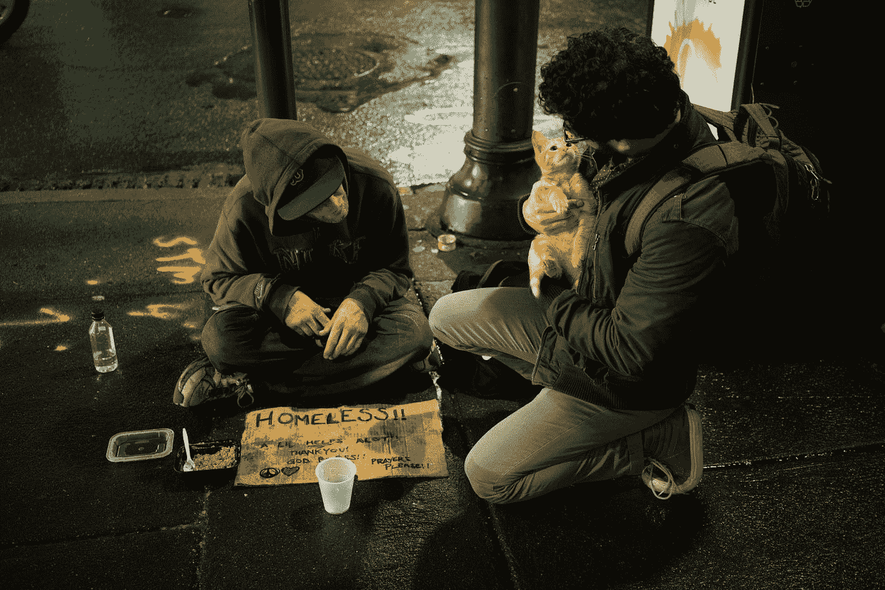

# 为什么我对陌生人比对自己的家人更好？

> 原文：<https://medium.com/swlh/why-am-i-kinder-to-strangers-than-to-my-own-family-ce678e4f7563>

Photo by [Zac Durant](https://unsplash.com/@zacdurant?utm_source=medium&utm_medium=referral) on [Unsplash](https://unsplash.com?utm_source=medium&utm_medium=referral)

上周，我写了一篇关于持续的边境危机和在危险旅程中面临危险的脆弱儿童的报道。我同情那些孩子和他们的家人。

这个故事也让我想到了一些其他的事情。我意识到我很容易对陌生人、朋友、同事，甚至是媒体上的作家充满同情和怜悯…