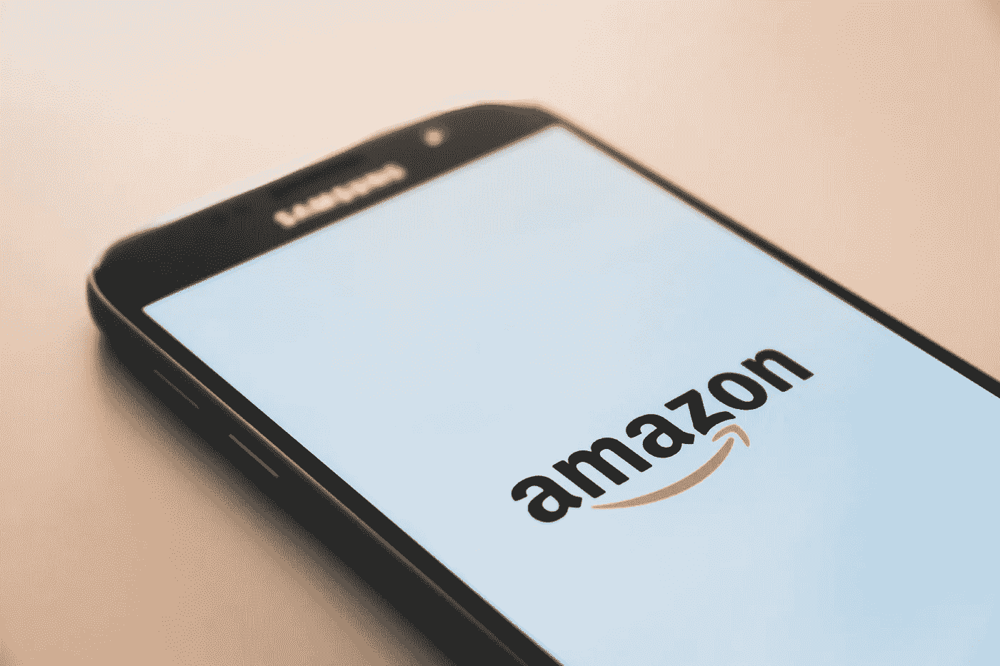

# 为什么亚马逊对我们不好

> 原文：<https://medium.com/swlh/why-amazon-isnt-good-for-us-f0dbae3e88ed>

## 亚马逊是一种便捷的网上购物方式，但从长远来看，他们的“不留活口”方式对消费者不利。

不难理解为什么美国人爱亚马逊。据估计，60%的家庭订阅了亚马逊 Prime 服务，几乎一半的在线收入都是在亚马逊平台上消费的。冲击亚马逊的“立即购买”…