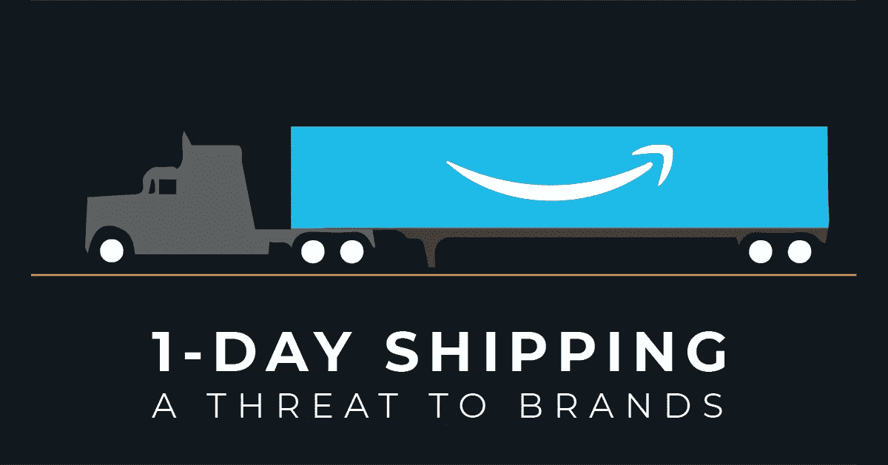
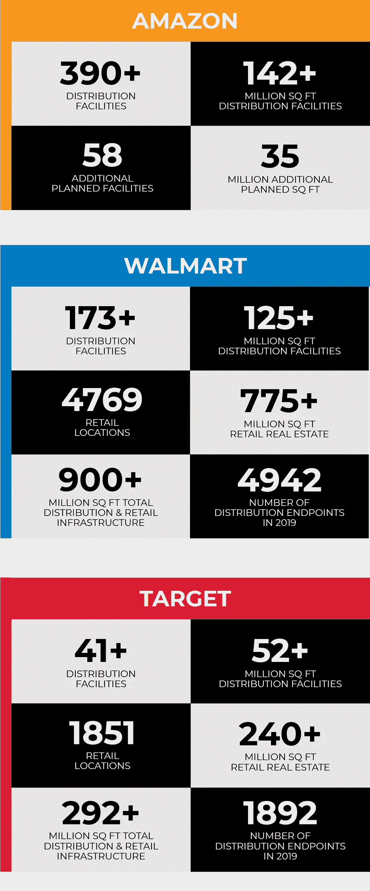

# 为什么亚马逊的一日送达对品牌的威胁比零售商更大

> 原文：<https://medium.com/swlh/why-amazons-move-to-one-day-shipping-is-a-greater-threat-to-brands-than-retailers-23f1ac755f6c>

亚马逊在 4 月下旬成为头条新闻，当时其首席财务官 Brian Olsavsky 表示，他们将把 Prime 服务从免费的两天送货增加到免费的一天送货。Olsavsky 接着说，亚马逊计划在第二季度花费 8 亿美元，以便改善其仓储和交付基础设施，从而实现这一目标。

现在，这一宣布已经尘埃落定，重要的是要考虑亚马逊为什么要采取这一举措，以及它在寻求主导电子商务和越来越多的零售整体方面给亚马逊带来了什么优势。

许多新闻媒体很快报道了这一消息，并写道，他们认为这一消息将对沃尔玛和塔吉特(Target)等其他零售商造成压力，两家零售商的股价应声下跌。

然而，这种对沃尔玛和塔吉特的负面展望被夸大了，并没有说明更大的压力会出现在哪里。亚马逊的一日免费送货对单个品牌的影响最大。

在一个直接面向消费者的电子商务时代，品牌可以通过网站而非零售商向客户销售产品来提高自己的利润率，缩短向客户交付产品的时间已变得至关重要。一个品牌可以拥有数百万的社交媒体追随者和积极参与的观众，但如果他们不能足够快地将产品送到人们手中，并在自己的网站上将注意力货币化，那么许多机会就会被浪费或转移到零售商或在线市场。

虽然就在不久前，许多品牌还在通过使用“统一运费”等程序收取标准运费来创造正收入，但当亚马逊提供免费两天运费时，情况很快发生了变化。自那以后，在过去十年的大部分时间里，各品牌都在努力赶上交货速度和运营效率，以满足并负担得起客户的“免费送货”期望。品牌的应对措施是开设更多的仓库，与第三方物流提供商合作，并简化其仓库运营，以跟上在线业务的新成本，对于许多品牌来说，他们成功地实现了转型。

品牌在他们的基础设施上进行这些投资，因为他们看到了通过网站销售给他们带来的保持利润的财务机会。

品牌也不孤单，像沃尔玛和塔吉特这样的领先零售商不得不进行大量投资来改善他们的基础设施和交付能力，以保持与亚马逊和品牌本身的竞争力。

这是一场争夺交易的战斗。

所有这些投资和效率的提高对品牌、零售商甚至消费者来说都是巨大的，但现在亚马逊提高了送货要求，将被甩在后面的是品牌，而不是零售商。

对品牌来说，更糟糕的是，新的一天送达要求可能无法实现。

与品牌相比，沃尔玛和塔吉特这样的零售商拥有品牌所没有的规模优势。在过去的三到五年里，一个品牌可能已经在分销能力和更高效的运营方面投资了数千万甚至数亿美元，而沃尔玛和塔吉特已经各自投资了数十亿美元。在 2017 年至 2019 年底期间，Target 正在投资 70 亿美元的资本和每年 10 亿美元的运营成本，以实现其商店和分销网络的现代化。沃尔玛承诺改善其运营，其最近的计划是[在 2019 年投资](https://digiday.com/retail/walmart-spending-11-billion-revamp-stores-year/)110 亿美元，以强调其商店的技术并提高其电子商务绩效。

所有这些都是亚马逊、沃尔玛和塔吉特百货在分销基础设施方面的主要优势。从占地面积和销售终端来看，这些公司在美国取得的规模使他们在缩短向每个客户的交付时间和获得更多交易方面具有巨大优势:

*数据来源:[亚马逊](http://www.mwpvl.com/html/amazon_com.html)、[沃尔玛](http://www.mwpvl.com/html/walmart.html)、[塔吉特](http://www.mwpvl.com/html/target.html)

虽然亚马逊一直以大力投资分销网络来改善客户交付而闻名，但沃尔玛和塔吉特现在也在这么做。这三大巨头可以负担得起扩大其分销基础设施所需的数十亿美元投资，方法是将成本分摊到每年数百万件商品和数亿笔个人交易中。没有品牌可以竞争。

沃尔玛和塔吉特也从他们可以利用的零售点的现有基础设施中受益。对他们来说，挑战是连接每个现有端点的同等部分，因为它正在添加新的设施来提高他们的电子商务性能。

很少有品牌拥有可持续地向客户提供一日送达所需的基础设施、资源或交易量。

当亚马逊、沃尔玛和塔吉特转向当天送达时会发生什么？

如果品牌认为支持两天送达很难而且很贵，那么将送达时间缩短到一天，更不用说即将到来的当天送达了，几乎是不可能的。

这给顾客留下了什么？当人们去购买下一件夹克、裤子、手机套、汽车座椅、处方药或杂货时，你认为他们会去哪里购物？为什么有人会花更多的钱，等待更长的时间，还要去多个网站购买他们想要的东西？

在线市场与实体分销和零售点相结合，为亚马逊、沃尔玛和塔吉特提供了品牌无法比拟的客户便利体验，这些公司将因此继续主导交易，进而主导销售。

不借助在线市场或零售合作伙伴来建立品牌变得更加困难。