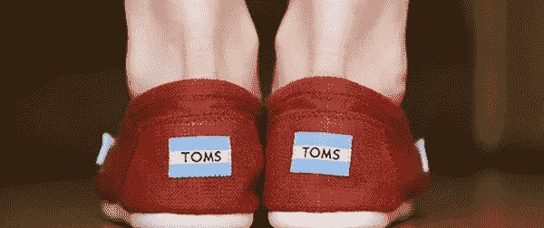
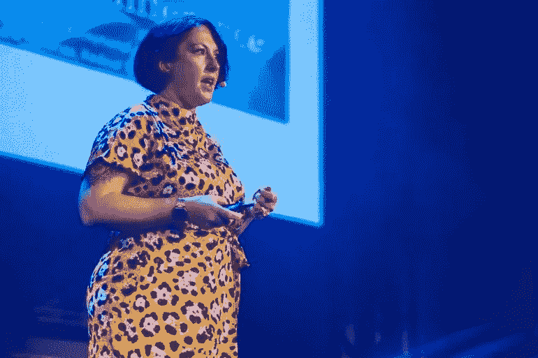
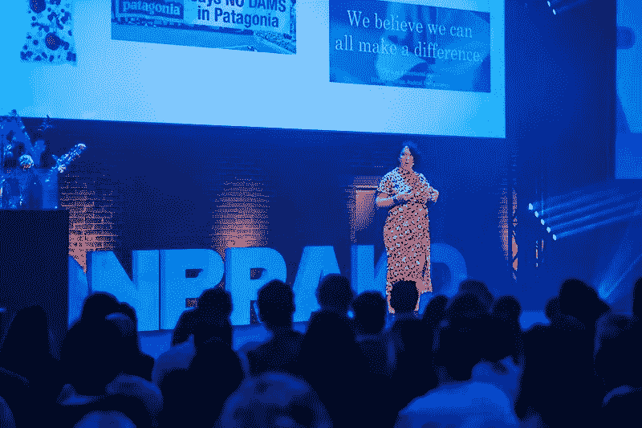

# TOMS 为什么以及如何赋予一对一新的意义

> 原文：<https://medium.com/swlh/why-and-how-toms-is-giving-new-meaning-to-one-for-one-1b2a8775bbbb>

## **好的商业模式第一部分**

## 好的商业模式是那些想要创造影响力的公司的商业模式。通过使用这些模型中的一个，你正在为解决你的核心业务中的一个社会问题做出贡献。对于商业公司，像 TOMS，他是最早使用“一对一”商业模式的人之一；对于想要成长的基金会，像 Dance4Life，他们以自己的商业模式“社交特许经营”奠定了爆发式增长的基础；对于像 Peerby 这样的社会企业家来说，他们让邻居能够通过他们的多边平台互相借或租东西。

“商业模式为好”系列的第一部分是关于一对一的商业模式，并描述了 TOMS 如何赋予该模式新的含义。

当 TOMS 在 2006 年开始时，他们以一对一的原则独树一帜。如果你买一双 TOMS 鞋，需要一双鞋的孩子将免费得到一双鞋。在过去的几年里，TOMS 已经失去了批判精神。这就是为什么他们将“一双鞋换一双鞋”的模式发展为“一次购买，一个目的”。这篇文章展示了他们是如何到达那里的，以及新的方向是什么样子的。

# 变革者讲述他们的故事

2018 年，TOMS 与当地的变革者合作，他们从 TOMS 获得了一个平台来分享他们的故事。他们共同致力于变革者的美好事业，为这一特定事业创造更多的意识。TOMS 公司 EMEA 营销总监丽莎·霍格在 OnBrand18 上提出了这一新方向，并在演讲后的采访中提供了更多细节。2 月 21 日，TOMS 正式宣布了这一新方向。

*Lisa Hogg at OnBrand Amsterdam 2018 — Image copyright Dan Taylor*

从 2019 年春天开始，TOMS 将关注无家可归者、女性赋权和社会企业家等问题。TOMS 与 Centrepoint、Ashoka 以及欧洲变革者约书亚·库姆比斯、艾拉·格蕾丝·丹顿和萨拉·努鲁等合作伙伴一起工作。

第一批项目于 3 月开始。约书亚·库姆比斯将带领一个艺术巡展，目的是为欧洲城市日益严重的无家可归问题创造更多的意识。TOMS 将与 Sara Nuru 和 Ashoka Germany 一起资助社会企业家峰会和加速器，以支持和培养下一代社会企业家。

# TOMS 的旅程

这种变化不是一夜之间发生的。它始于不同的见解:

*   TOMS 不再是独一无二的；
*   TOMS 被指贫困色情；
*   顾客更关心附近发生的事情。

## 1.TOMS 不再是唯一的

去年，在 Onbrand17 期间，Lisa 展示了从 2006 年开始，越来越多的公司以 TOMS 为榜样，采用一对一原则。帮宝适跟随 TOMS 在 2006 年推出一包疫苗。每一包贴有“一包一疫苗”标签的帮宝适通过联合国儿童基金会向发展中国家的一位母亲和她的婴儿捐赠了一份破伤风疫苗。2007 年和 2008 年，又有 5 家公司加入，2009 年，它真正起飞了。2009 年至 2016 年间，约有 70 家公司应用了“一对一”模式，如联合利华的“购买一封邮件——我们将捐赠一顿饭”和星巴克的“每袋咖啡种一棵树”。

## 2.TOMS 被指控贫困色情

这些年来，TOMS 承受了很多批评。

许多人认为，当 8 亿人缺乏基本营养时，捐赠鞋子不是一种有效的援助方式。其他人声称免费赠送鞋子伤害了当地的制鞋业。

在这一评论之后，TOMS 委托进行了一项研究，发现他们的产品经常替代以前的鞋子。作为回应，TOMS 与当地鞋类制造商建立了合作关系，目标是让他们三分之一的产品在他们捐赠的社区生产。

尽管他们在应用一对一原则方面不断改进，但许多评论家仍然声称 TOMS 描绘了一幅过于性感的画面，让其客户感觉良好，而这种情绪在现实中并不存在。

在《哈佛政治评论》(Harvard Political Review)中，罗素·里德(Russell Reed)指出:“如果一个人寻求最大化影响，他应该考虑直接向一个关注影响、更直接地致力于创造有效、可持续的变化并充分利用每一分钱的组织捐款。”

这正是 TOMS 现在走的路。丽莎:“我们因贫困色情而受到抨击，因此我们现在给变革者一个平台来讲述他们的故事。萨拉·努鲁(Sara Nuru)是这些变革者之一，她是 nuruCoffee 的创始人，nuruCoffee 是一家总部位于柏林的社交初创公司，旨在增强埃塞俄比亚女性的能力。

## 3.顾客更关心附近发生的事情

丽莎:“我们深入了解了顾客关心的问题，并问自己:作为一个品牌，我们如何让人们参与到对他们真正重要的问题中，并为他们提供一个参与的平台。

我们发现本地方面非常重要:我们的顾客不太在乎给远方的人穿鞋。他们更关心后院发生的事情。

但是这些国家之间有很大的不同:

*   德国人真的很在乎尊严:“一个更好的我，造就一个更好的社区”。我们如何解决这个问题？
*   从英国的角度来看，这关乎公平。在英国，他们认为公共和私营部门应该赋予年轻人权力；
*   在法国，他们相信团结:团结起来的权利和承诺。年轻积极分子的崛起将很快产生重大影响。"

*Lisa Hogg at OnBrand Amsterdam 2018 — Image copyright Dan Taylor*

# 新方向

丽莎:“我们实现了经济赋权和教育。这是整个 EMEA 地区的保护伞，可以涵盖许多不同的主题。

在每个国家，我们选择一个特定的问题，与不同的合作伙伴合作:

1.  变革者
2.  专注于解决特定问题的组织
3.  媒体公司

在英国，我们选择关注无家可归者。很难弄清楚无家可归的问题到底有多大，因为你不可能总是看到他们。所以我们问自己:哪个有影响力的人真正在那个领域有所作为？

## 1.变革者

在英国无家可归者的案例中，TOMS 与约书亚·库姆比斯合作，后者为伦敦街头的无家可归者理发。他分享了自己的故事，并表明小小的善举也能带来改变。

## 2.专注于解决特定问题的组织

为了真正产生影响，TOMS 与英国一家帮助无家可归者的组织 Centrepoint 合作。

## 3.媒体公司

TOMS 与 Good-Loop 媒体公司合作，该公司也采用一对一原则。如果消费者看了广告，就会得到一份礼物，他们可以将这份礼物捐给三大慈善事业之一。这样，每个接触点都有目的。"

# 赋予一对一新的意义

根据这一新方向，TOMS 赋予了“一对一”原则新的含义:“一次购买一个目的”，专注于特定国家人民最关心的问题。TOMS 不再捐赠一双鞋，而是投资于变革者的公益事业，这样他们可以一起创造更多的影响。

在 OnBrand 期间，这一方向被称为一对一的新含义，但根据 2 月 22 日的[新闻稿，它是对一对一模式的补充。随着这一增加，TOMS 越来越接近像本&杰里的活动家营销，谁帮助多个社会运动创造影响。](https://www.prnewswire.com/news-releases/toms-reveals-its-giving-evolution-inspiring-creating-and-innovating-social-change-300800268.html)

看起来 TOMS 已经创造了一些全新的东西，但在幕后，TOMS 已经遥遥领先。丽莎:“将来，我们想让顾客在购买一双鞋时有机会选择他们自己的好理由。”TOMS 已经在零售行业尝试这种方法，并希望在所有渠道推广这种方法。"

# 如果你真的想改变，那就改变你的商业模式

TOMS 是一个很好的例子，说明了一家公司应该如何持续倾听客户认为重要的东西。如果你真的想改变你的公司，你也必须改变你的商业模式。根据你的情况，你要么选择进一步发展你目前的商业模式，要么选择一个全新的模式。只要它符合贵公司的愿景和客户的需求。合适的商业伙伴可以帮助你进一步发展，创造更多的影响。

# 你准备好开始了吗？

我为你创建了一份[免费清单](https://lnkd.in/eCXWgat),让你开始一个有影响力的成功事业。如果你勾选了所有的选项，你就为你的事业打下了完美的基础。

## 这篇文章发表在[《创业](https://medium.com/swlh)》上，这是 Medium 最大的创业刊物，有+443，678 人关注。

## 订阅接收[我们的头条新闻](https://growthsupply.com/the-startup-newsletter/)。

