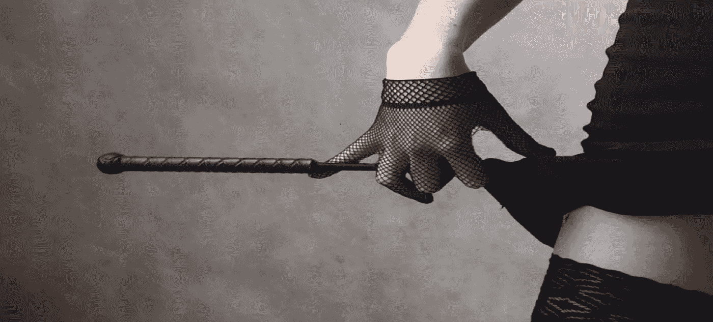

# 为什么焦虑可能是一个巨大的刺激:色情心理的矛盾心理

> 原文：<https://medium.com/swlh/why-anxiety-can-be-a-huge-turn-on-the-paradoxical-psychology-of-the-erotic-mind-2a33f76b4072>

几年前，在研究女性性功能障碍(我的论文题目)时，我偶然发现林恩·菲利普 1999 年出版的关于女性性的书《与危险调情》中的一段话，这让我觉得非常有说服力。在一次采访中，一名年轻女子描述了一次典型的性遭遇——一次概括了分心…