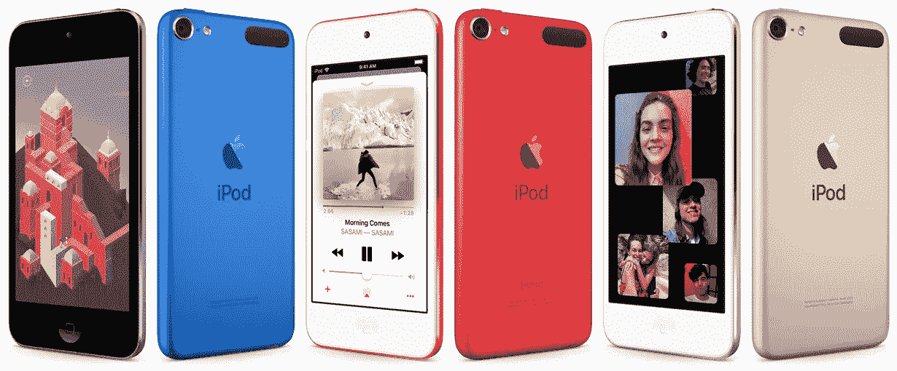

# 为什么苹果在 2019 年刷新了 iPod

> 原文：<https://medium.com/swlh/why-apple-refreshed-the-ipod-in-2019-24d68346ce94>

几周前，苹果发布了第七代 iPod Touch。有些人会说更新早就应该了，因为距离上一次 iPod Touch 发布已经快四年了。其他人可能会说它从来没有到期，因为谁还会用 iPod 呢？虽然我不再认为 iPod 是苹果的旗舰产品之一，但我可以理解为什么要更新产品线。

image courtesy of [Apple](https://www.apple.com/ipod-touch/)